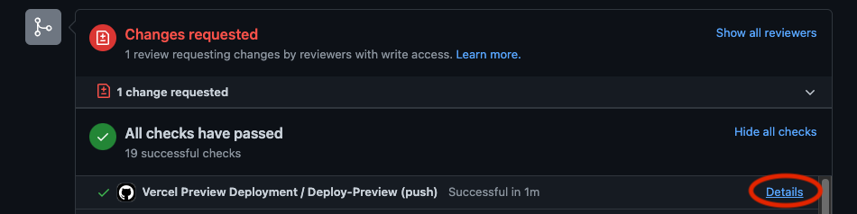

This is the open source project for the Chainlink documentation.

## Developing

```
npm install && npm run dev
```

## Docs architecture

- All docs are markdown and stored in `/src/pages`.
- Navigation is JSON in `/src/config/sidebar.ts`

## Deploy Preview

This repo is configured to automatically create a draft preview environment
on Vercel when a PR is opened. You can access the URL by viewing the PR checks

