import { Aside, ClickToZoom } from "@components"
import { Tabs } from "@components/Tabs"
import CcipCommon from "@features/ccip/CcipCommon.astro"

This tutorial implements **production-grade cross-chain tokens** using Chainlink CCIP with **dual-layer multisig governance** between Solana Devnet and Ethereum Sepolia. You'll build a **production-ready governance architecture** following **Path A** from the [CCIP Cross-Chain Token Integration Guide](/ccip/concepts/cross-chain-token/svm/integration-guide#path-a-full-self-service-mint-authority-controlled).

## What You Will Build

Upon completion, you will have:

| Component                 | Implementation                       | Security Model              |
| ------------------------- | ------------------------------------ | --------------------------- |
| **Ethereum Sepolia**      | ERC20 token with CCIP BurnMint pool  | EOA-controlled (tutorial)   |
| **Solana Devnet**         | SPL token with dual-layer governance | Squads + SPL multisig       |
| **Cross-Chain Bridge**    | Bidirectional token transfers        | Autonomous operations       |
| **Architecture (Solana)** | Production-ready setup               | Enterprise-grade governance |

### Key Innovation: Dual-Layer Governance

**Separation of Concerns Architecture:**

- **Layer 1 (Squads)**: Controls CCIP administration, pool ownership, protocol configuration
- **Layer 2 (SPL Multisig)**: Controls mint authority with Pool Signer PDA for autonomous operations

### Implementation Steps

You will:

1. **Deploy EVM token and pool** on Ethereum Sepolia
1. **Create governed SPL tokens** with Squads as mint authority
1. **Establish dual-layer multisig** (Squads → SPL multisig transfer)
1. **Configure cross-chain pools** with autonomous operations
1. **Test bidirectional transfers** and validate governance

**Path A Production Governance Options:**

- **Direct Transfer**: Transfer mint authority directly to Pool Signer PDA - suitable for development and testing ([see tutorial](/ccip/tutorials/svm/cross-chain-tokens/direct-mint-authority))
- **Educational Multisig**: Learn SPL token multisig concepts - foundation for understanding ([see tutorial](/ccip/tutorials/svm/cross-chain-tokens/spl-token-multisig-tutorial))
- **Production Governance** (this tutorial): Implement enterprise-grade dual-layer multisig with Squads governance

## Technical Architecture

Before proceeding with implementation, it's crucial to understand the **dual-layer multisig governance** architecture that provides enterprise-grade security.

### Production Dual-Layer Multisig Architecture

This tutorial implements **dual-layer multisig governance** that separates concerns between protocol administration and token operations:

```mermaid
graph TB
    subgraph "Layer 1: Squads Multisig Governance"
        SM["Squads Multisig<br/>🏛️ Protocol Administration"]
        TAR["CCIP Token Admin<br/>Registry Roles"]
        PO["CCIP Pool<br/>Ownership"]
        CS["Cross-chain<br/>Settings"]
        PA["Protocol-level<br/>Functions"]

        SM --> TAR
        SM --> PO
        SM --> CS
        SM --> PA
    end

    subgraph "Layer 2: SPL Token Multisig"
        SPL["SPL Token Multisig<br/>🔐 Mint Authority Control"]
        PDA["Pool Signer PDA<br/>⚡ Autonomous Operations"]
        SMG["Squads Multisig<br/>🏛️ Governance Control"]

        SPL --> PDA
        SPL --> SMG
    end

    subgraph "Cross-Chain Operations"
        CCT["Cross-Chain<br/>Token Transfers"]
        AUTO["Autonomous<br/>Pool Operations"]
    end

    SM -.-> SMG
    PDA --> AUTO
    AUTO --> CCT
    PA --> CCT

    classDef governance fill:#e1f5fe,stroke:#0277bd,stroke-width:2px
    classDef autonomous fill:#f3e5f5,stroke:#7b1fa2,stroke-width:2px
    classDef operations fill:#e8f5e8,stroke:#2e7d32,stroke-width:2px

    class SM,SMG,TAR,PO,CS,PA governance
    class PDA,AUTO autonomous
    class SPL,CCT operations
```



### Why Dual-Layer Architecture

**Separation of Concerns**:

- **Layer 1 (Squads)**: Controls all CCIP protocol operations, pool configuration, and administrative functions
- **Layer 2 (SPL Multisig)**: Controls token mint authority with autonomous pool operations

**Production Benefits**:

- **Comprehensive Security**: Two independent governance layers with different security models
- **Operational Autonomy**: Pool Signer PDA enables autonomous cross-chain transfers
- **Administrative Control**: Squads provides enterprise-grade governance for all configuration changes
- **Scalable Architecture**: Suitable for mainnet deployment with proper governance procedures

This tutorial focuses on **mainnet-ready governance architecture**, demonstrating how to implement comprehensive security controls while maintaining autonomous cross-chain token transfers through BurnMint token pools.

<Aside type="caution" title="SPL Token Multisig Limitations">
  **Critical Understanding**: The SPL token multisig demonstrated in this tutorial can **ONLY execute SPL token
  instructions** (mint, burn, transfer, etc.). It **cannot execute arbitrary transactions** or general governance
  operations like transferring CCIP admin roles or pool ownership. This is why we implement dual-layer governance:
  Squads handles arbitrary governance operations while SPL multisig handles only token-specific operations.
</Aside>

## Tutorial Approach

This tutorial implements **production-grade cross-chain tokens** using a **three-terminal workflow** across specialized repositories:

| Terminal       | Repository                                                                                                                  | Purpose                          | Commands      |
| -------------- | --------------------------------------------------------------------------------------------------------------------------- | -------------------------------- | ------------- |
| **Terminal 1** | [CCIP Solana base58 Generator](https://github.com/smartcontractkit/ccip-solana-base58-generator)                            | Generate governance transactions | `pnpm bs58`   |
| **Terminal 2** | [Smart Contract Examples (Hardhat)](https://github.com/smartcontractkit/smart-contract-examples/tree/main/ccip/cct/hardhat) | Deploy EVM components            | `npx hardhat` |
| **Terminal 3** | [Solana Starter Kit](https://github.com/smartcontractkit/solana-starter-kit)                                                | Test cross-chain transfers       | `yarn`        |

### Key Implementation Notes

- **Terminal 1** generates base58-encoded transactions for Squads multisig governance
- **Terminal 2** uses EOA for tutorial simplicity; production deployments should use multisig wallets (e.g., Safe)
- **Terminal 3** validates end-to-end cross-chain functionality

### base58 Transaction Execution Workflow

**Transaction Generation & Validation:**

1. **CLI Simulation**: Each base58 transaction is automatically simulated during generation
1. **Error Handling**: If simulation fails, error logs appear in terminal - **do not upload failed transactions to Squads**
1. **Success Indicator**: Successful simulation shows transaction preview and base58 output

**Squads Multisig Execution Process:**

1. **Propose**: A signer imports the base58 transaction into Squads UI → "Add instruction" → "Import base58 encoded tx" → **Initiate Transaction**
1. **Approve**: Required threshold (M) of signers review and approve the transaction
1. **Simulate** (Recommended): Before execution, signers can simulate through Squads interface to preview onchain effects
1. **Execute**: After threshold approval, any signer can execute the transaction

<Aside type="note" title="Security Best Practice">
  **Always Simulate Before Execution**: Use Squads' built-in simulation feature before executing transactions. This
  shows exactly what will happen onchain and is critical for validating complex governance operations before commitment.
</Aside>

### Environment Variables

Variables use prefixes to prevent confusion across repositories:

| Prefix   | Usage              | Examples                                   |
| -------- | ------------------ | ------------------------------------------ |
| `ETH_*`  | Ethereum addresses | `ETH_TOKEN_ADDRESS`, `ETH_POOL_ADDRESS`    |
| `SOL_*`  | Solana addresses   | `SOL_TOKEN_MINT`, `SOL_POOL_ADDRESS`       |
| `CCIP_*` | Protocol constants | `CCIP_POOL_PROGRAM`, `CCIP_ROUTER_PROGRAM` |

## Prerequisites

### System Requirements

Install these tools before starting:

**Package Managers:**

- **Node.js v20+**: Required for all repositories
- **pnpm**: Required for base58 Generator (`npm install -g pnpm`)
- **yarn**: Required for Solana Starter Kit (`npm install -g yarn`)

**Solana Development:**

- **Solana CLI**: [Installation guide](https://docs.solana.com/cli/install-solana-cli-tools)

**Wallets:**

- **Solana wallet**: [Phantom](https://phantom.app/) or [Backpack](https://backpack.app/) for Devnet operations
- **Ethereum wallet**: [MetaMask](https://metamask.io/) for Sepolia testnet operations

### Repository Setup

Clone and install dependencies for all three repositories:

**Terminal 1: base58 Generator**

```bash
git clone https://github.com/smartcontractkit/ccip-solana-bs58-generator.git
cd ccip-solana-bs58-generator
pnpm install
```

**Terminal 2: EVM Hardhat**

```bash
git clone https://github.com/smartcontractkit/smart-contract-examples.git
cd smart-contract-examples/ccip/cct/hardhat
npm install
npm run compile
```

**Terminal 3: Solana Starter Kit**

```bash
git clone https://github.com/smartcontractkit/solana-starter-kit.git
cd solana-starter-kit
yarn install
```

**Create and configure the .env file:**

```bash
# Create .env file in the project root
cat > .env << 'EOF'
EVM_PRIVATE_KEY=your_private_key_here
EVM_RPC_URL=your_rpc_url_here
EOF
```

Replace the placeholder values with:

- `EVM_PRIVATE_KEY`: Your Ethereum wallet private key (for Sepolia testnet operations)
- `EVM_RPC_URL`: Your Ethereum RPC URL (from [Alchemy](https://www.alchemy.com/), [Infura](https://www.infura.io/), or another provider)

### Environment Configuration

**Solana Configuration:**

```bash
# Set Solana CLI to devnet
solana config set --url https://api.devnet.solana.com

# Create keypair (ONLY IF NEEDED)
solana-keygen new --outfile ~/.config/solana/id.json

# Check Config

solana config get

# Fund wallet
solana airdrop 3
```

**Ethereum Sepolia Configuration:**

```bash
# In Terminal 2 (Hardhat directory)
npx env-enc set-pw
npx env-enc set
```

Required environment variables:

- `ETHEREUM_SEPOLIA_RPC_URL`: RPC endpoint ([Alchemy](https://www.alchemy.com/) or [Infura](https://www.infura.io/))
- `PRIVATE_KEY`: Testnet wallet private key
- `ETHERSCAN_API_KEY`: API key from [Etherscan](https://etherscan.io/apis)

**Testnet Tokens:**

- **Solana Devnet**: Use `solana airdrop 3` for SOL
- **Ethereum Sepolia**: Use [Chainlink faucets](https://faucets.chain.link/) for LINK and ETH

### Squads Multisig Setup

<Aside type="caution" title="Required: Create Squads Multisig">
  **Before starting this tutorial**, you must create a Squads multisig on Solana Devnet. This will serve as your Layer 1
  governance mechanism for all CCIP administrative operations.
</Aside>

**Step 1: Prepare Signers**

Create multiple wallet addresses for your multisig signers:

```bash
# Create additional signers using Solana CLI
solana-keygen new --outfile ~/.config/solana/signer2.json
solana-keygen new --outfile ~/.config/solana/signer3.json

# Get signer addresses
solana address --keypair ~/.config/solana/id.json
solana address --keypair ~/.config/solana/signer2.json
solana address --keypair ~/.config/solana/signer3.json

# Fund signers (minimum 0.1 SOL each for transaction fees)
solana transfer <SIGNER2_ADDRESS> 0.1 --allow-unfunded-recipient
solana transfer <SIGNER3_ADDRESS> 0.1 --allow-unfunded-recipient
```

Alternatively, create signers in Phantom wallet and fund them:

```bash
# Transfer SOL to Phantom-created addresses
solana transfer <PHANTOM_SIGNER_ADDRESS> 0.5 --allow-unfunded-recipient
```

**Step 2: Create Your Squad**

1. Visit [devnet.squads.so](https://devnet.squads.so)
1. Connect your Solana wallet (e.g., Phantom/Backpack)
1. Click "Create New Squad"
1. Configure your multisig:
   - **Squad Name**: Choose a descriptive name (e.g., "CCIP Token Governance")
   - **Members**: Add wallet addresses of all signers
   - **Threshold**: Set approval threshold (recommended: 2/3 or 3/5)

<Aside type="note" title="Threshold Best Practices">

- **Avoid 1/n thresholds** (single point of failure)
- **Avoid maximum thresholds** (e.g., 3/3 prevents recovery if
  one key is lost)

</Aside>

**Step 3: Record Critical Addresses**

After Squad creation, navigate to Settings tab and record these addresses.

**In Terminal 1 (base58 Generator), export the vault address:**

```bash
# CRITICAL: Use the VAULT address, NOT the multisig address
export SOL_SQUAD_VAULT_MULTISIG="YOUR_VAULT_ADDRESS_HERE"
```

Verify the export:

```bash
echo "Squads Vault Address: $SOL_SQUAD_VAULT_MULTISIG"
```

<Aside type="caution" title="Vault vs Multisig Address">
  **IMPORTANT**: Only use the **Vault address** for setting authorities and receiving funds. The **Multisig address** is
  used only for CLI detection - sending assets to it causes **irreversible loss**.
</Aside>

**Step 4: Test Your Squad**

Perform a small test transaction to verify setup:

1. Send a small amount of SOL to your Squad vault
1. Create a test transaction in Squads UI (e.g., SOL transfer to your wallet)
1. Confirm all signers can approve transactions
1. Execute the transaction

For detailed setup guidance, see the [Squads Documentation](https://docs.squads.so/).

### Token Creation Option

<Aside type="note" title="Existing Token Requirements">
  **Important**: You can only skip token creation if you have an existing SPL token where the **mint authority is already controlled by your Squad vault**.

**Two scenarios:**

1. **Mint authority = Squad vault**: Skip to Step 3 (pool initialization) and export your existing mint address
1. **Mint authority ≠ Squad vault**: You must first transfer mint authority to your Squad vault, OR create a fresh token in Step 2

**For fresh start**: Proceed with Step 2 to create a new token with Squad vault as mint authority from the beginning.

</Aside>

## Phase 1: EVM Chain Setup (Ethereum Sepolia)

In this phase, you will deploy ERC20 tokens and configure CCIP BurnMint pools on Ethereum Sepolia. This setup is identical across all Path A variants and provides the foundation for cross-chain operations.

<Aside type="note" title="Terminal Context Check">
  **Current Focus: Terminal 2 (EVM Hardhat)** You'll be working exclusively in the Hardhat repository for this phase.
  Other terminals remain idle. Note: This tutorial uses EOA for simplicity; production deployments should use multisig
  wallets.
</Aside>

### Step 1: Prepare EVM Environment

First, set up your terminal and verify your environment:

<Tabs client:visible>
<Fragment slot="tab.1">Terminal Setup</Fragment>
<Fragment slot="tab.2">Verification</Fragment>

<Fragment slot="panel.1">

```bash
# Terminal 2: Navigate to EVM repository

# Verify location and project structure

# Should output: smart-contract-examples/ccip/cct/hardhat

pwd

# Verify private key variables are set:

npx env-enc view

```

</Fragment>

<Fragment slot="panel.2">

```bash
# Expected verification output
$ npx env-enc view
The following variables are encrypted and stored in /../smart-contract-examples/ccip/cct/hardhat/.env.enc
PRIVATE_KEY = c8376...
ETHEREUM_SEPOLIA_RPC_URL = https://sepolia.gateway.tenderly.co/...
ETHERSCAN_API_KEY = 9AVYS...
```

</Fragment>
</Tabs>

### Step 2: Deploy ERC20 Token

Deploy your cross-chain token on Ethereum Sepolia:

<Tabs client:visible>
<Fragment slot="tab.1">Command</Fragment>
<Fragment slot="tab.2">Expected Output</Fragment>

<Fragment slot="panel.1">

```bash
# Deploy ERC20 token
npx hardhat deployToken \
  --name "AEM Token" \
  --symbol "BnmAEM" \
  --decimals 18 \
  --verifycontract true \
  --network sepolia

# Copy the token address from the output above
```

</Fragment>

<Fragment slot="panel.2">

```bash
2025-08-12T14:40:21.321Z info: Deploying BurnMintERC20 contract to sepolia
2025-08-12T14:40:21.321Z info: Waiting 3 blocks for transaction 0xd47c0c1113d42bed9a8cc6bb002aaebf1d859573df865fcd3ff3c0b0fb1f59f7 to be confirmed...
2025-08-12T14:40:48.620Z info: Token deployed to: 0x9cE471d0a7bE21ee32276ddE49104fE02C812906
2025-08-12T14:40:48.682Z info: Granting mint and burn roles to 0x9d087fC03ae39b088326b67fA3C788236645b717
2025-08-12T14:41:27.376Z info: Verifying contract...
The contract 0x9cE471d0a7bE21ee32276ddE49104fE02C812906 has already been verified on the block explorer. If you're trying to verify a partially verified contract, please use the --force flag.
https://sepolia.etherscan.io/address/0x9cE471d0a7bE21ee32276ddE49104fE02C812906#code
2025-08-12T14:41:27.983Z info: Token contract deployed and verified
```

</Fragment>
</Tabs>

Set the token address variable:

<Tabs client:visible>
<Fragment slot="tab.1">Set Variable</Fragment>
<Fragment slot="tab.2">Verification</Fragment>

<Fragment slot="panel.1">
```bash
# REPLACE with actual address from deployment output
export ETH_TOKEN_ADDRESS="<INSERT_YOUR_ACTUAL_TOKEN_ADDRESS>"
```

Verify the address is set correctly:

```bash
echo "✅ Ethereum Token Address: $ETH_TOKEN_ADDRESS"

```

</Fragment>

<Fragment slot="panel.2">

```bash
$ echo "✅ Ethereum Token Address: $ETH_TOKEN_ADDRESS"

✅ Ethereum Token Address: 0x9cE471d0a7bE21ee32276ddE49104fE02C812906

```

</Fragment>
</Tabs>

### Step 3: Deploy and Configure CCIP BurnMint Pool

Deploy the BurnMint token pool:

<Tabs client:visible>
<Fragment slot="tab.1">Command</Fragment>
<Fragment slot="tab.2">Expected Output</Fragment>

<Fragment slot="panel.1">

```bash
# Deploy BurnMint pool
npx hardhat deployTokenPool \
  --tokenaddress $ETH_TOKEN_ADDRESS \
  --localtokendecimals 18 \
  --pooltype burnMint \
  --verifycontract true \
  --network sepolia
```

</Fragment>

<Fragment slot="panel.2">

```bash
2025-08-12T14:44:45.695Z info: Waiting 3 blocks for transaction 0xb751ffe3f2689a30807aa3205e35d69bd9bff08f0f52f7122a306b4a73216fde to be confirmed...
2025-08-12T14:54:13.315Z info: Token pool deployed to: 0xB8aE4F4eDDFEFb3476039606Bfb8caE74a554342
2025-08-12T14:54:13.318Z info: Granting mint and burn roles to 0xB8aE4F4eDDFEFb3476039606Bfb8caE74a554342 on token 0x9cE471d0a7bE21ee32276ddE49104fE02C812906
2025-08-12T14:54:49.181Z info: Verifying contract...
The contract 0xB8aE4F4eDDFEFb3476039606Bfb8caE74a554342 has already been verified on the block explorer. If you're trying to verify a partially verified contract, please use the --force flag.
https://sepolia.etherscan.io/address/0xB8aE4F4eDDFEFb3476039606Bfb8caE74a554342#code
2025-08-12T14:54:49.800Z info: Token pool contract deployed and verified

📝 Copy the pool address from the output above:
Pool Address: 0xB8aE4F4eDDFEFb3476039606Bfb8caE74a554342
```

</Fragment>
</Tabs>

Set the pool address and configure:

<Tabs client:visible>
<Fragment slot="tab.1">Setup & Configure</Fragment>
<Fragment slot="tab.2">Expected Output</Fragment>

<Fragment slot="panel.1">

```bash
# REPLACE with actual address from deployment output
export ETH_POOL_ADDRESS="<INSERT_YOUR_ACTUAL_POOL_ADDRESS>"
```

Verify configuration

```
echo "✅ Ethereum Pool Address: $ETH_POOL_ADDRESS"
```

</Fragment>

<Fragment slot="panel.2">

```bash
$ echo "✅ Ethereum Pool Address: $ETH_POOL_ADDRESS"
✅ Ethereum Pool Address: 0xB8aE4F4eDDFEFb3476039606Bfb8caE74a554342
```

</Fragment>
</Tabs>

### Step 4: Mint Initial Token Supply

Mint tokens for testing:

<Tabs client:visible>
<Fragment slot="tab.1">Command</Fragment>
<Fragment slot="tab.2">Expected Output</Fragment>

<Fragment slot="panel.1">

```bash
# Mint 1000 tokens for testing
npx hardhat mintTokens \
  --tokenaddress $ETH_TOKEN_ADDRESS \
  --amount 1000000000000000000000 \
  --network sepolia

# Note: Balance can be checked in your wallet or through block explorer

echo "✅ Tokens minted successfully"

```

</Fragment>

<Fragment slot="panel.2">

```bash
$ # Mint 1000 tokens for testing
npx hardhat mintTokens \
  --tokenaddress $ETH_TOKEN_ADDRESS \
  --amount 1000000000000000000000 \
  --network sepolia

# Note: Balance can be checked in your wallet or through block explorer

echo "✅ Tokens minted successfully"


2025-08-12T15:48:47.067Z info: Minting 1000000000000000000000 of BnmAEM tokens to 0x9d087fC03ae39b088326b67fA3C788236645b717
2025-08-12T15:49:26.227Z info: Minted 1000000000000000000000 of BnmAEM tokens to 0x9d087fC03ae39b088326b67fA3C788236645b717 - transaction hash: 0xff28bbced4415a26efa158a3e5cfbdc41b7d8503dd60a75ae38c0ede1f9257fd
2025-08-12T15:49:26.316Z info: Current balance of 0x9d087fC03ae39b088326b67fA3C788236645b717 is 1000000000000000000000 BnmAEM
✅ Tokens minted successfully
```

</Fragment>
</Tabs>

### Step 5: Claim CCIP Admin Role

In this step, you will use the `claimAdmin` task to register your EOA as the administrator for the deployed token on Ethereum Sepolia. This process involves calling the `RegistryModuleOwnerCustom` contract, which will fetch the CCIP admin of the token and set it up as the admin in the registry.

<Tabs client:visible>
<Fragment slot="tab.1">Claim Admin</Fragment>
<Fragment slot="tab.2">Expected Output</Fragment>

<Fragment slot="panel.1">

```bash
# Claim admin role for CCIP token registry
npx hardhat claimAdmin \
  --tokenaddress $ETH_TOKEN_ADDRESS \
  --network sepolia
```

</Fragment>

<Fragment slot="panel.2">

```bash
2025-08-12T21:22:38.303Z info: 🎯 Attempting to claim admin for token 0x9cE471d0a7bE21ee32276ddE49104fE02C812906 using getCCIPAdmin mode
2025-08-12T21:22:39.072Z info: Current token CCIP admin: 0x9d087fC03ae39b088326b67fA3C788236645b717
2025-08-12T21:22:39.072Z info: Claiming admin of 0x9cE471d0a7bE21ee32276ddE49104fE02C812906 via getCCIPAdmin() for CCIP admin 0x9d087fC03ae39b088326b67fA3C788236645b717
2025-08-12T21:23:13.903Z info: ✅ Successfully claimed admin of 0x9cE471d0a7bE21ee32276ddE49104fE02C812906 using getCCIPAdmin mode. Transaction: 0x3765b1e222b7bb55ea7d601a10a27e83d7cbfe76ad8a286b39f833c9f17283ee
```

</Fragment>
</Tabs>

### Step 6: Accept CCIP Admin Role

In this step, you will use the `acceptAdminRole` task to accept the admin role for the deployed token on Ethereum Sepolia. Once you have claimed the role, accepting the role finalizes your control over the token administration.

<Tabs client:visible>
<Fragment slot="tab.1">Accept Admin Role</Fragment>
<Fragment slot="tab.2">Expected Output</Fragment>

<Fragment slot="panel.1">

```bash
# Accept admin role to complete CCIP registration
npx hardhat acceptAdminRole \
--tokenaddress $ETH_TOKEN_ADDRESS \
--network sepolia
```

</Fragment>

<Fragment slot="panel.2">

```bash
2025-08-12T21:26:15.066Z info: Accepted admin role for token 0x9cE471d0a7bE21ee32276ddE49104fE02C812906 tx: 0x883db3a63416eb02c56ec39661f6a7c90e7db8cabb57779a653008404b714d37
```

</Fragment>
</Tabs>

### Step 7: Register Pool with Token

In this step, you will use the `setPool` task to register the BurnMint token pool with the token in Ethereum's TokenAdminRegistry contract. This function sets the pool contract address for the token, enabling it for CCIP cross-chain transfers. Only the token administrator can call this function.

<Tabs client:visible>
<Fragment slot="tab.1">Set Pool</Fragment>
<Fragment slot="tab.2">Expected Output</Fragment>

<Fragment slot="panel.1">

```bash
# Register token pool with TokenAdminRegistry contract
npx hardhat setPool \
--tokenaddress $ETH_TOKEN_ADDRESS \
--pooladdress $ETH_POOL_ADDRESS \
--network sepolia
```

</Fragment>

<Fragment slot="panel.2">

```bash
2025-08-12T21:27:24.993Z info: Setting pool for token 0x9cE471d0a7bE21ee32276ddE49104fE02C812906 to 0xB8aE4F4eDDFEFb3476039606Bfb8caE74a554342 by 0x9d087fC03ae39b088326b67fA3C788236645b717
2025-08-12T21:28:14.346Z info: Pool set for token 0x9cE471d0a7bE21ee32276ddE49104fE02C812906 to 0xB8aE4F4eDDFEFb3476039606Bfb8caE74a554342
```

</Fragment>
</Tabs>

**Phase 1 Complete**: Save your variables:

<Tabs client:visible>
<Fragment slot="tab.1">Save Configuration</Fragment>
<Fragment slot="tab.2">Verification</Fragment>

<Fragment slot="panel.1">

```bash
# Save Phase 1 variables for later use
echo "export ETH_TOKEN_ADDRESS=\"$ETH_TOKEN_ADDRESS\"" > ~/.phase1_vars
echo "export ETH_POOL_ADDRESS=\"$ETH_POOL_ADDRESS\"" >> ~/.phase1_vars

echo "=== Phase 1 Complete - EVM Setup ==="
echo "✅ ETH Token: $ETH_TOKEN_ADDRESS"
echo "✅ ETH Pool: $ETH_POOL_ADDRESS"

```

</Fragment>

<Fragment slot="panel.2">

```bash
$ # Save Phase 1 variables for later use
echo "export ETH_TOKEN_ADDRESS=\"$ETH_TOKEN_ADDRESS\"" > ~/.phase1_vars
echo "export ETH_POOL_ADDRESS=\"$ETH_POOL_ADDRESS\"" >> ~/.phase1_vars

echo "=== Phase 1 Complete - EVM Setup ==="
echo "✅ ETH Token: $ETH_TOKEN_ADDRESS"
echo "✅ ETH Pool: $ETH_POOL_ADDRESS"


=== Phase 1 Complete - EVM Setup ===
✅ ETH Token: 0x9cE471d0a7bE21ee32276ddE49104fE02C812906
✅ ETH Pool: 0xB8aE4F4eDDFEFb3476039606Bfb8caE74a554342
```

</Fragment>
</Tabs>

<Aside type="note" title="Phase 1 Complete">
  **EVM Setup Complete**: You have successfully deployed and configured the EVM side. Next, you'll implement the
  production-grade Solana side with dual-layer multisig governance.
</Aside>

## Phase 2: Solana Setup with Production Dual Multisig Governance

In this phase, you will implement the **production-grade dual-layer multisig governance** architecture on Solana Devnet.

<Aside type="note" title="Terminal Context Check">
  **Current Focus: Terminal 1 (base58 Generator)** Switch to the base58 generator repository for transaction generation.
  This tool creates Base58-encoded transactions that will be executed through Squads UI.
</Aside>

### Step 1: Prepare base58 Environment

<Tabs client:visible>
<Fragment slot="tab.1">Terminal Setup</Fragment>
<Fragment slot="tab.2">Verification</Fragment>

<Fragment slot="panel.1">

```bash
# Terminal 1: Verify location
# Should output: ccip-solana-bs58-generator
pwd
```

Set up CCIP protocol constants on Solana Devnet (DO NOT CHANGE THESE)

```bash
export CCIP_POOL_PROGRAM="3BrkN1XcyeafuMZxomLZBUVdasEtpdMmpWfsEQmzN7vo"
export CCIP_ROUTER_PROGRAM="Ccip842gzYHhvdDkSyi2YVCoAWPbYJoApMFzSxQroE9C"
export CCIP_FEE_QUOTER_PROGRAM="FeeQPGkKDeRV1MgoYfMH6L8o3KeuYjwUZrgn4LRKfjHi"
```

Get your Solana wallet address for token recipient:

```bash
export SOL_WALLET_ADDRESS=$(solana address)
```

Verify all required variables are set:

```bash
echo "✅ Pool Program: $CCIP_POOL_PROGRAM"
echo "✅ Router Program: $CCIP_ROUTER_PROGRAM"
echo "✅ Squad Vault (from Prerequisites): $SOL_SQUAD_VAULT_MULTISIG"
echo "✅ Recipient Wallet: $SOL_WALLET_ADDRESS"
```

</Fragment>

<Fragment slot="panel.2">

```bash
$ # Terminal 1: Verify location
# Should output: ccip-solana-bs58-generator
pwd

/.../ccip-solana-bs58-generator

$ export CCIP_POOL_PROGRAM="3BrkN1XcyeafuMZxomLZBUVdasEtpdMmpWfsEQmzN7vo"
export CCIP_ROUTER_PROGRAM="Ccip842gzYHhvdDkSyi2YVCoAWPbYJoApMFzSxQroE9C"
export CCIP_FEE_QUOTER_PROGRAM="FeeQPGkKDeRV1MgoYfMH6L8o3KeuYjwUZrgn4LRKfjHi"

$ export SOL_WALLET_ADDRESS=$(solana address)

$ echo "✅ Pool Program: $CCIP_POOL_PROGRAM"
echo "✅ Router Program: $CCIP_ROUTER_PROGRAM"
echo "✅ Squad Vault (from Prerequisites): $SOL_SQUAD_VAULT_MULTISIG"
echo "✅ Recipient Wallet: $SOL_WALLET_ADDRESS"

✅ Pool Program: 3BrkN1XcyeafuMZxomLZBUVdasEtpdMmpWfsEQmzN7vo
✅ Router Program: Ccip842gzYHhvdDkSyi2YVCoAWPbYJoApMFzSxQroE9C
✅ Squad Vault (from Prerequisites): 59eNrRrxrZMdqJxS7J3WGaV4MLLog2er14kePiWVjXtY
✅ Recipient Wallet: EPUjBP3Xf76K1VKsDSc6GupBWE8uykNksCLJgXZn87CB
```

</Fragment>
</Tabs>

### Step 2: Create SPL Token (Layer 2 Foundation)

This command generates a transaction that creates a new SPL token mint with the following features:

- **Mint Authority**: Set to your Squad vault multisig for governance control
- **Metaplex Metadata**: Includes token name, symbol, and URI for cross-platform compatibility
- **Initial Supply**: Automatically mints 5,000 tokens (5,000,000,000,000 smallest units) to your wallet
- **Deterministic Address**: Uses a seed-based approach for predictable mint addresses

<Aside type="tip" title="Customize Your Token">

**Recommended**: Create your own token metadata! Upload your token's JSON metadata to IPFS (using services like Pinata, NFT.Storage, or Arweave), then update the command parameters:

- `--name "Your Token Name"` (max 32 characters)
- `--symbol "YOUR-SYMBOL"` (max 10 characters)
- `--uri "https://your-ipfs-gateway/ipfs/your-hash"`
- `--initial-supply "your-amount"` (in smallest units)

This ensures your token has unique branding and proper metadata for cross-platform compatibility.

</Aside>

Generate the SPL token creation transaction (customize parameters or reuse the example):

<Tabs client:visible>
<Fragment slot="tab.1">Command</Fragment>
<Fragment slot="tab.2">Expected Output</Fragment>

<Fragment slot="panel.1">

```bash
# Generate SPL token creation transaction with initial supply
pnpm bs58 spl-token \
  --env devnet \
  --instruction create-mint \
  --authority $SOL_SQUAD_VAULT_MULTISIG \
  --decimals 9 \
  --with-metaplex true \
  --name "AEM" \
  --symbol "CCIP-AEM" \
  --uri "https://cyan-pleasant-anteater-613.mypinata.cloud/ipfs/bafkreieirlwjqbtzniqsgcjebzexlcspcmvd4woh3ajvf2p4fuivkenw6i" \
  --initial-supply 5000000000000 \
  --recipient $SOL_WALLET_ADDRESS
```

</Fragment>

<Fragment slot="panel.2">

```bash
$ pnpm bs58 spl-token \
  --env devnet \
  --instruction create-mint \
  --authority "59eNrRrxrZMdqJxS7J3WGaV4MLLog2er14kePiWVjXtY" \
  --decimals "9" \
  --with-metaplex "true" \
  --name "AEM" \
  --symbol "CCIP-AEM" \
  --uri "https://cyan-pleasant-anteater-613.mypinata.cloud/ipfs/bafkreieirlwjqbtzniqsgcjebzexlcspcmvd4woh3ajvf2p4fuivkenw6i" \
  --initial-supply "5000000000000" \
  --recipient "EPUjBP3Xf76K1VKsDSc6GupBWE8uykNksCLJgXZn87CB"

> ccip-solana-bs58-generator@1.0.0 bs58
> tsx src/index.ts spl-token --env devnet --instruction create-mint...

INFO [2025-08-12 18:00:46.051]: 🔍 Validating create mint parameters...
INFO [2025-08-12 18:00:46.052]: 📋 Token Program: spl-token (TokenkegQfeZyiNwAJbNbGKPFXCWuBvf9Ss623VQ5DA)
INFO [2025-08-12 18:00:46.052]: 📋 Decimals: 9
INFO [2025-08-12 18:00:46.052]: 📋 Metaplex metadata enabled
INFO [2025-08-12 18:00:46.052]: 📋 Initial supply: 5000000000000 smallest units
INFO [2025-08-12 18:00:46.052]: 📋 Recipient: EPUjBP3Xf76K1VKsDSc6GupBWE8uykNksCLJgXZn87CB
INFO [2025-08-12 18:00:46.060]: 📋 Generated mint address: EbrEbzXXUGurxRq55xtie1r4e8rHH99jUAwUaEygrKND

🎯 COPY TRANSACTION DATA BELOW:
EmZGftWY3kgypWmDBu8jg2G4E5RzYwFCF3oQiXDcrr1fMeQqxTtmWqrWN8qRQ63otsHxXAH1mJXMRxm2hjwbpqF1WdD8AwZto8S2RVyYq6wS4XQ4pxXs38WgqgfFPWfMUXQu12fAqmthYZtfsY7pcYa8LsL48EBR9gSeR5rXHwKoXFv3Xp8Wm4XR86Aw3Gfqhv23vXgZQCKKEpPDHAccPeny5WmLpH3pcmP6yNBMBcyS6KV46DxcCX5mRSLg1Z2fbxvyeYsjb1woeykihAwE2FxSGnNxHN6SZ3yUpkE4a9Yt6nrK4ASqNgFZAGDCNEqdjmg2peW85DsvyijZeq9Meb3b57u6oBEBKB6Pbra56DcqgMk1zX1Y1neRfDuEfpETKCZbaC559vV2bHy94ybevY4fqxXLuJZjuppqpMPJKpfCNfMrSCp8M2UjGQERTfo5zLyccyP3p23GYZnYX1jWhe6f9QRBU24JcacETu1WKpACRQ2JWtShmu2PdXhPtD3X6u36rdRcEYrwipfBVJrqEWZJzPCYXu4tbHzH5MqRfgmtHKQJyS7MAM9wqYeFw7MBz2XrR2mscPZMjdmzTxg7bfaTFicxwXanpY1tBPJmb1uLDv5cQuMVp5MS59H81Kwfn3mssm7LN6KZYNwVzEo5Hd6TSm12oTqxDbqiXW21J5hmr9jVNvEEyHeaBPxuJn52QjU1EwE28u7uxNoXTqjP2mo26wsUBAhgGNYFuyXMrFqGzVsfyVeR28aefuQTmPkynVJeotCtwWE9KaGHGUT4wLBratbY2EGXmLNQVbWYD9gcEwFdtBwPxPLqyCHgwtt2qqZFgNr7j9Rw2FM75gb7H9SXvjRidgK74238LiADNVXZjRGSMa7WmfjXv8ShApAzcrG4JPoyE5KB9bPoBYAEwh3VakMVw2w5x913hZ2rG91wybdUTrVG4PBchirZkwuLMupAfb8wGMuno2PdAxWQwz94KiikBSb3fMS8q5MqXrepch1izPUDUoZPyi3g3ptBHeaHog3sqdSn9TVXFS6AwpWcRuQG93qAkRFuAM9p9LantroeqisgQAWDA1ALhEYFvC19p8y2tHQkZtxEV3vD77uH

────────────────────────────────────────────────────────────────────────────────
INFO [2025-08-12 18:00:46.989]: ✅ Transaction simulation completed
INFO [2025-08-12 18:00:46.990]: 🎉 Transaction generated successfully!
INFO [2025-08-12 18:00:46.990]: 📋 Generated mint address: EbrEbzXXUGurxRq55xtie1r4e8rHH99jUAwUaEygrKND
INFO [2025-08-12 18:00:46.990]: Size: 815 bytes, Compute units: 82,237

```

</Fragment>
</Tabs>

<Aside type="note" title="Squads Execution Required">

**Execute this base58 transaction in Squads UI:**

- **Import**: Copy the base58 output → Squads UI → "Add
  instruction" → "Import base58 encoded tx"

- **Review**: Verify transaction details, check authority and mint
- **Simulate**: Simulate the transaction to ensure it will succeed
- **Approve**: Obtain required threshold signatures
- **Execute**: Complete the transaction execution

</Aside>

After execution, set the token mint:

<Tabs client:visible>
<Fragment slot="tab.1">Set Variable</Fragment>
<Fragment slot="tab.2">Verification</Fragment>

<Fragment slot="panel.1">

```bash
# Copy the mint address from the base58 generator output above
export SOL_TOKEN_MINT="<YOUR_ACTUAL_MINT_ADDRESS>"
```

Verify the token mint:

```bash
echo "✅ Token Mint: $SOL_TOKEN_MINT"
```

</Fragment>

<Fragment slot="panel.2">

```bash
export SOL_TOKEN_MINT="EbrEbzXXUGurxRq55xtie1r4e8rHH99jUAwUaEygrKND"

✅ Token Mint: EbrEbzXXUGurxRq55xtie1r4e8rHH99jUAwUaEygrKND
```

</Fragment>
</Tabs>

### Step 3: Initialize BurnMint Token Pool (Before Multisig Setup)

<Aside type="caution" title="Why Initialize Pool Before Mint Authority Transfer">
  **Critical**: Since your Squad multisig currently holds the mint authority, you can follow [**PATH A**
  (self-service)](/ccip/concepts/cross-chain-token/svm/integration-guide#path-a-full-self-service-mint-authority-controlled)
  and initialize the pool without Chainlink Labs intervention. However, once you transfer mint authority to an SPL token
  multisig, you would lose this capability - SPL token multisigs can only execute SPL token instructions, not CCIP pool
  initialization instructions. Initialize the pool now while you still have direct control.

**Alternative Options**: If you have an existing token where the mint authority is held by a wallet or another multisig under your control, you can transfer the mint authority to your Squad vault first to follow the self-service path. Otherwise, if you cannot control the mint authority, you can submit a [registration request](https://chain.link/ccip-contact?v=Tokens:%20Token%20admin%20registration) to have Chainlink Labs initialize the pool for you.

</Aside>

This command creates only one new account and establishes references to existing infrastructure:

**What Gets Created:**

- **Pool State PDA**: Creates the on-chain Pool State account that stores your token's CCIP configuration

**What Gets Referenced (Not Created):**

- **Authority Assignment**: Sets your Squad vault as the pool owner with full configuration control
- **Router Integration**: References the existing global CCIP router and RMN (Risk Management Network)
- **Pool Signer PDA**: The Pool Signer PDA is mathematically derived but not created - it will be used on-demand during cross-chain operations

The `initialize-pool` instruction creates only the Pool State account for your SPL token mint, establishing you as the pool owner while referencing existing global infrastructure.

<Aside type="caution" title="Important: Pool Signer PDA is NOT Created">
  **Critical Understanding**: The `initialize-pool` command does **NOT** create the Pool Signer PDA. It only: 1.
  **Creates**: The Pool State account to store configuration 2. **References**: Existing accounts (Global Config, Token
  Mint, etc.) 3. **Derives**: The Pool Signer PDA address mathematically (but doesn't create the account) The Pool
  Signer PDA account will be created automatically by Solana runtime when first used during cross-chain operations.
</Aside>

Generate the pool initialization transaction:

<Tabs client:visible>
<Fragment slot="tab.1">Command</Fragment>
<Fragment slot="tab.2">Expected Output</Fragment>

<Fragment slot="panel.1">
```bash
# Generate pool initialization transaction
pnpm bs58 burnmint-token-pool --env devnet --instruction initialize-pool \
  --program-id $CCIP_POOL_PROGRAM \
  --mint $SOL_TOKEN_MINT \
  --authority $SOL_SQUAD_VAULT_MULTISIG
```

</Fragment>

<Fragment slot="panel.2">

```bash
$ pnpm bs58 burnmint-token-pool --env devnet --instruction initialize-pool \
  --program-id $CCIP_POOL_PROGRAM \
  --mint $SOL_TOKEN_MINT \
  --authority $SOL_SQUAD_VAULT_MULTISIG

> ccip-solana-bs58-generator@1.0.0 bs58 /Users/.../ccip-solana-bs58-generator
> tsx src/index.ts burnmint-token-pool --env devnet --instruction initialize-pool --program-id 3BrkN1XcyeafuMZxomLZBUVdasEtpdMmpWfsEQmzN7vo --mint EbrEbzXXUGurxRq55xtie1r4e8rHH99jUAwUaEygrKND --authority 59eNrRrxrZMdqJxS7J3WGaV4MLLog2er14kePiWVjXtY

bigint: Failed to load bindings, pure JS will be used (try npm run rebuild?)
🔗 Validating RPC connectivity...
✅ RPC connection verified
🔄 Generating initialize (pool) transaction...
🔄 Building and simulating transaction...
✅ Transaction simulation completed

🎯 COPY TRANSACTION DATA BELOW:

FBAuxuhVLrvnXFVrZZ818eWSCdJFif8x7mkKK5X6RBW7AUvzhNKB2mMHfHAKP4UuBMDNQppHs931Vb1UuMYXoXqFE7FCNzYrmEgzok88gdhg37Ep4CegtPWh63eKEC9nx1eDD5nzw5hRn2oSHj3FWELNydyyPfDj4RUZkd5zBQhMczzV9U2Y7AUtLxAD4d9QRrc8akCnF4dR3maHQsyuKz9KEV1mKkKuQ1EhyN5rqRKJHydv4Jq1gnYiJQg9ERdJRTsN285veSmYgVoxYMphtczU5qcbHk5A9K2boa3YpTKNtLkgKve7GWs81QZ47V8Fpzdb9BU3aWBoZPiAs7zuDCJ4KtJdtq8uER5Yv73rgyPzj8ABEtxCGaDapi3E

────────────────────────────────────────────────────────────────────────────────

🎉 Transaction generated successfully!

📋 Transaction Details:
Instruction: burnmint.initialize
Size: 279 bytes
Base58 length: 380 characters
Compute units: 36,373
Generated: 2025-08-12T16:33:28.920Z

🔗 Transaction Data (Base58):

💡 Triple-click the line above to select the entire transaction data

📊 Account Information:
Total accounts: 7 1. gbsmzERXogUy74hMq5zYwAkKWd2Y2BKobsvhs26Z3MM (writable) 2. EbrEbzXXUGurxRq55xtie1r4e8rHH99jUAwUaEygrKND (read-only) 3. 59eNrRrxrZMdqJxS7J3WGaV4MLLog2er14kePiWVjXtY (signer, writable) 4. 11111111111111111111111111111111 (read-only) 5. 3BrkN1XcyeafuMZxomLZBUVdasEtpdMmpWfsEQmzN7vo (read-only) 6. HtzqB9hPSCvcbB5ZbeeBEYmmnCrtK4Zeg2R1hapcCT4n (read-only) 7. 3sM46YunqEj7xWQaV3fzogeuAnqDZkW1suiVfGqpTRHz (read-only)

```

</Fragment>
</Tabs>

**Account Breakdown from the Transaction (Example):**

| Account | Address                                        | Purpose                                                     |
| ------- | ---------------------------------------------- | ----------------------------------------------------------- |
| **#1**  | `gbsmzERXogUy74hMq5zYwAkKWd2Y2BKobsvhs26Z3MM`  | **Pool State PDA** - Your main pool configuration           |
| **#2**  | `EbrEbzXXUGurxRq55xtie1r4e8rHH99jUAwUaEygrKND` | Token Mint (your token)                                     |
| **#3**  | `59eNrRrxrZMdqJxS7J3WGaV4MLLog2er14kePiWVjXtY` | Authority (your Squad vault)                                |
| **#4**  | `11111111111111111111111111111111`             | System Program                                              |
| **#5**  | `3BrkN1XcyeafuMZxomLZBUVdasEtpdMmpWfsEQmzN7vo` | CCIP Pool Program                                           |
| **#6**  | `HtzqB9hPSCvcbB5ZbeeBEYmmnCrtK4Zeg2R1hapcCT4n` | Program Data PDA                                            |
| **#7**  | `3sM46YunqEj7xWQaV3fzogeuAnqDZkW1suiVfGqpTRHz` | **Global Config PDA** - Program-wide configuration settings |

**Key Addresses You Need:**

- **Account #1** → `SOL_POOL_ADDRESS` (writable account = pool state)
- **Pool Signer PDA** → Must be derived separately (NOT in transaction accounts)

<Aside type="note" title="Squads Execution Required">

**Execute this base58 transaction in Squads UI:**

- **Import**: Copy the base58 output → Squads UI → "Add
  instruction" → "Import base58 encoded tx"

- **Review**: Verify pool initialization parameters
- **Simulate**: Simulate the transaction to ensure it will succeed
- **Approve**: Obtain required threshold signatures
- **Execute**: Complete the transaction execution

</Aside>

After execution, set the pool state address from the transaction:

```bash
# Set the pool state address from Account #1 in the transaction above
export SOL_POOL_ADDRESS="gbsmzERXogUy74hMq5zYwAkKWd2Y2BKobsvhs26Z3MM"
```

### Step 4: Derive Pool Signer PDA

The Pool Signer PDA is the critical address that will serve as the autonomous signing authority for cross-chain mint and burn operations.

<Tabs client:visible>
<Fragment slot="tab.1">Derive Pool Signer</Fragment>
<Fragment slot="tab.2">Expected Output</Fragment>

<Fragment slot="panel.1">

```bash
# Derive all pool-related accounts including the Pool Signer PDA
pnpm bs58 utils \
  --env devnet \
  --instruction derive-accounts \
  --program-type burnmint-token-pool \
  --program-id "$CCIP_POOL_PROGRAM" \
  --mint "$SOL_TOKEN_MINT"
```

</Fragment>

<Fragment slot="panel.2">

```bash
> ccip-solana-bs58-generator@1.0.0 bs58 /Users/.../ccip-solana-bs58-generator
> tsx src/index.ts utils --env devnet --instruction derive-accounts --program-type burnmint-token-pool --program-id 3BrkN1XcyeafuMZxomLZBUVdasEtpdMmpWfsEQmzN7vo --mint EbrEbzXXUGurxRq55xtie1r4e8rHH99jUAwUaEygrKND

bigint: Failed to load bindings, pure JS will be used (try npm run rebuild?)
🔗 Validating RPC connectivity...
INFO [2025-08-13 00:55:54.229 +0200]: Starting deriveAccounts command
    command: "derive-accounts"
    programType: "burnmint-token-pool"
    programId: "3BrkN1XcyeafuMZxomLZBUVdasEtpdMmpWfsEQmzN7vo"
    mint: "EbrEbzXXUGurxRq55xtie1r4e8rHH99jUAwUaEygrKND"
    globalOptions: {
      "environment": "devnet",
      "resolvedRpcUrl": "https://api.devnet.solana.com"
    }
   ✅ RPC connection verified
🔍 Deriving burnmint-token-pool accounts...

📊 Derived Accounts:

1. Pool State PDA
   Address: gbsmzERXogUy74hMq5zYwAkKWd2Y2BKobsvhs26Z3MM
   Seeds: ["ccip_tokenpool_config", mint]
   Bump: 253
   Description: Main pool configuration account (created by initialize-pool)

2. Pool Signer PDA
   Address: ERs5qJvN1hu4rGrtuj6WMhZznVWbCyf2g4ynMgFHCWKN
   Seeds: ["ccip_tokenpool_signer", mint]
   Bump: 254
   Description: Autonomous mint/burn authority for cross-chain operations

3. Global Config PDA
   Address: 3sM46YunqEj7xWQaV3fzogeuAnqDZkW1suiVfGqpTRHz
   Seeds: ["config"]
   Bump: 254
   Description: Program-wide configuration settings

4. Pool Token ATA
   Address: 9pVYxjcnV2gTTFrwnrh2Lb1zUwTefEjxSbpia1B6NUtn
   Seeds: [mint, pool_signer_pda, token_program]
   Description: Pool's token account (owned by Pool Signer PDA)

CRITICAL ADDRESS FOR CROSS-CHAIN OPERATIONS:
   Pool Signer PDA: ERs5qJvN1hu4rGrtuj6WMhZznVWbCyf2g4ynMgFHCWKN
   ↳ This address signs all mint/burn transactions autonomously

INFO [2025-08-13 00:55:56.236 +0200]: Detected SPL Token v1
    mint: "EbrEbzXXUGurxRq55xtie1r4e8rHH99jUAwUaEygrKND"
    programId: "TokenkegQfeZyiNwAJbNbGKPFXCWuBvf9Ss623VQ5DA"
INFO [2025-08-13 00:55:56.238 +0200]: ✅ Account derivation completed successfully
    command: "derive-accounts"
```

</Fragment>
</Tabs>

Set the Pool Signer PDA address for use in subsequent steps:

<Tabs client:visible>
<Fragment slot="tab.1">Set Variables</Fragment>
<Fragment slot="tab.2">Verification</Fragment>

<Fragment slot="panel.1">

```bash
# Set the Pool Signer PDA from the derivation output above
export SOL_POOL_SIGNER_PDA="<YOUR_ACTUAL_POOL_SIGNER_PDA>"
```

Verify both addresses are set correctly:

```bash
echo "Pool Address: $SOL_POOL_ADDRESS"
echo "Pool Signer PDA: $SOL_POOL_SIGNER_PDA"
```

</Fragment>

<Fragment slot="panel.2">

```bash
Pool Address: gbsmzERXogUy74hMq5zYwAkKWd2Y2BKobsvhs26Z3MM
Pool Signer PDA: ERs5qJvN1hu4rGrtuj6WMhZznVWbCyf2g4ynMgFHCWKN
```

</Fragment>
</Tabs>

### Step 5: Register CCIP Administrator

This two-step process establishes your Squad vault as the CCIP token administrator, enabling you to enable your token in CCIP. Since your Squad vault currently holds the mint authority, you can complete this registration using the [self-service registration flow](/ccip/concepts/cross-chain-token/svm/registration-administration#self-service-registration-flow) without external assistance.

**Why This Works**: The Router's [owner_propose_administrator](/ccip/concepts/cross-chain-token/svm/registration-administration#self-service-registration-flow) instruction verifies on-chain that the caller matches the token's `mint_authority` field. Your Squad vault has this authority, enabling [PATH A self-service registration](/ccip/concepts/cross-chain-token/svm/integration-guide#path-a-full-self-service-mint-authority-controlled).

#### Sub-step 5a: Propose Administrator

The [owner_propose_administrator](/ccip/concepts/cross-chain-token/svm/registration-administration#self-service-registration-flow) instruction creates a TokenAdminRegistry PDA for your token and sets your Squad vault as the [pending administrator](/ccip/concepts/cross-chain-token/svm/registration-administration#self-service-registration-flow):

<Tabs client:visible>
<Fragment slot="tab.1">Command</Fragment>
<Fragment slot="tab.2">Expected Output</Fragment>

<Fragment slot="panel.1">

```bash
# Generate administrator registration transaction
pnpm bs58 router --env devnet --instruction owner-propose-administrator \
  --program-id $CCIP_ROUTER_PROGRAM \
  --mint $SOL_TOKEN_MINT \
  --authority $SOL_SQUAD_VAULT_MULTISIG \
  --token-admin-registry-admin $SOL_SQUAD_VAULT_MULTISIG
```

</Fragment>

<Fragment slot="panel.2">

```bash
$ pnpm bs58 router --env devnet --instruction owner-propose-administrator \
  --program-id $CCIP_ROUTER_PROGRAM \
  --mint $SOL_TOKEN_MINT \
  --authority $SOL_SQUAD_VAULT_MULTISIG \
  --token-admin-registry-admin $SOL_SQUAD_VAULT_MULTISIG

> ccip-solana-bs58-generator@1.0.0 bs58 /Users/.../ccip-solana-bs58-generator
> tsx src/index.ts router --env devnet --instruction owner-propose-administrator --program-id Ccip842gzYHhvdDkSyi2YVCoAWPbYJoApMFzSxQroE9C --mint EbrEbzXXUGurxRq55xtie1r4e8rHH99jUAwUaEygrKND --authority 59eNrRrxrZMdqJxS7J3WGaV4MLLog2er14kePiWVjXtY --token-admin-registry-admin 59eNrRrxrZMdqJxS7J3WGaV4MLLog2er14kePiWVjXtY

bigint: Failed to load bindings, pure JS will be used (try npm run rebuild?)
🔗 Validating RPC connectivity...
✅ RPC connection verified
🔄 Generating owner_propose_administrator transaction...
🔄 Building and simulating transaction...
✅ Transaction simulation completed

🎯 COPY TRANSACTION DATA BELOW:

jCi2q3RM6PzJZRhgUPyQh5bBo2juVuAMP2tXHnkmWowRbPHQUuvY3qhvv97A976wLhPkR829gHc7B7TdsMvryLs7KR5demyaYqRFRcb7rtoZ6buybtiQRihoxGacBKHMnxZoMXbsN31BHrjFP3TK1efdwgoWzY9h7c8XF6cUR4JahMrzdrRZJqEzS49f793tyPvNqjKpzwoX8MVutBaY5nDxu8tWCmf2NsZyWKuQRwRDB9P9UvjDoM5gtzFxMn2NGMp2QGW8zkqkjPPUPKvRK4uArcMoFyeMrhkwYAX2ofA7BM4MeVJ5RxE681PWpmKFxb139rpsKM3j8oUoPxZgiugdHg9mHSd4tsRFZEK2pzoixLvzbXQgobXzc

────────────────────────────────────────────────────────────────────────────────

🎉 Transaction generated successfully!

📋 Transaction Details:
Instruction: router.owner_propose_administrator
Size: 277 bytes
Base58 length: 377 characters
Compute units: 19,785
Generated: 2025-08-12T17:06:30.169Z

🔗 Transaction Data (Base58):

💡 Triple-click the line above to select the entire transaction data

📊 Account Information:
Total accounts: 5 1. 3Yrg9E4ySAeRezgQY99NNarAmFLtixapga9MZb6y2dt3 (read-only) 2. E7STtSanxZmYmyH6nBeb27QCpEvue4uq7QZ62uinSRwR (writable) 3. EbrEbzXXUGurxRq55xtie1r4e8rHH99jUAwUaEygrKND (read-only) 4. 59eNrRrxrZMdqJxS7J3WGaV4MLLog2er14kePiWVjXtY (signer, writable) 5. 11111111111111111111111111111111 (read-only)

```

</Fragment>
</Tabs>

**Account Breakdown from the Transaction (Example):**

| Account | Address                                        | Description                                                           |
| ------- | ---------------------------------------------- | --------------------------------------------------------------------- |
| **#1**  | `3Yrg9E4ySAeRezgQY99NNarAmFLtixapga9MZb6y2dt3` | Router Config PDA (read-only)                                         |
| **#2**  | `E7STtSanxZmYmyH6nBeb27QCpEvue4uq7QZ62uinSRwR` | **🎯 Token Admin Registry PDA** - Gets created/updated for your token |
| **#3**  | `EbrEbzXXUGurxRq55xtie1r4e8rHH99jUAwUaEygrKND` | Token Mint (your token)                                               |
| **#4**  | `59eNrRrxrZMdqJxS7J3WGaV4MLLog2er14kePiWVjXtY` | Authority/Payer (your Squad vault)                                    |
| **#5**  | `11111111111111111111111111111111`             | System Program                                                        |

**What This Transaction Does:**
This transaction proposes your Squad vault as the administrator for your token in the Router's Token Admin Registry. **Account #2** is the Token Admin Registry PDA that stores who has administrative control over your token's cross-chain operations.

<Aside type="note" title="Squads Execution Required">

**Execute this base58 transaction in Squads UI:**

- **Import**: Copy the base58 output → Squads UI → "Add
  instruction" → "Import base58 encoded tx"

- **Review**: Verify transaction details and parameters
- **Simulate**: Simulate the transaction to ensure it will succeed
- **Approve**: Obtain required threshold signatures
- **Execute**: Complete the transaction execution

</Aside>

#### Sub-step 5b: Accept Administrator Role

The [accept_admin_role](/ccip/concepts/cross-chain-token/svm/registration-administration#self-service-registration-flow) instruction completes the [registration process](/ccip/concepts/cross-chain-token/svm/registration-administration#self-service-registration-flow) by having the pending administrator (your Squad vault) explicitly accept the CCIP token administrator role:

<Tabs client:visible>
<Fragment slot="tab.1">Accept Admin Role</Fragment>
<Fragment slot="tab.2">Expected Output</Fragment>

<Fragment slot="panel.1">

```bash
# Generate administrator role acceptance transaction
pnpm bs58 router --env devnet --instruction accept-admin-role \
  --program-id $CCIP_ROUTER_PROGRAM \
  --mint $SOL_TOKEN_MINT \
  --authority $SOL_SQUAD_VAULT_MULTISIG
```

</Fragment>

<Fragment slot="panel.2">

```bash
$ pnpm bs58 router --env devnet --instruction accept-admin-role \
  --program-id $CCIP_ROUTER_PROGRAM \
  --mint $SOL_TOKEN_MINT \
  --authority $SOL_SQUAD_VAULT_MULTISIG

> ccip-solana-bs58-generator@1.0.0 bs58 /Users/.../ccip-solana-bs58-generator
> tsx src/index.ts router --env devnet --instruction accept-admin-role --program-id Ccip842gzYHhvdDkSyi2YVCoAWPbYJoApMFzSxQroE9C --mint EbrEbzXXUGurxRq55xtie1r4e8rHH99jUAwUaEygrKND --authority 59eNrRrxrZMdqJxS7J3WGaV4MLLog2er14kePiWVjXtY

bigint: Failed to load bindings, pure JS will be used (try npm run rebuild?)
🔗 Validating RPC connectivity...
✅ RPC connection verified
🔄 Generating accept_admin_role_token_admin_registry transaction...
🔄 Building and simulating transaction...
✅ Transaction simulation completed

🎯 COPY TRANSACTION DATA BELOW:

2sM9hLJFuca8kadhK5vj9XrhMwgVdMHbbADrgprG7i6MGad9hyK9vQ7ZhV1JAvdBZJ6xwHmjaUJmjw6Kf8VyJXf51ppFmmBeAqEwKqPgbzgRDXfxn1oYB3q8LZXTfjATPZiX59ahdd9V4yW36Gj2mZnA6FQyBAtdmPpiYfva3vVqbERBhCcyVrUqbHRurVH6RpL8ENExot4UexBmtCikaM2tkyvNrnsTWUPcGVx4QMRxFjqzHxKhBWpPGA4g7yRgvUxgp2XbVb3Rf6AY6DynkMk22sDJ8HM3b

────────────────────────────────────────────────────────────────────────────────

🎉 Transaction generated successfully!

📋 Transaction Details:
Instruction: router.accept_admin_role_token_admin_registry
Size: 212 bytes
Base58 length: 289 characters
Compute units: 15,454
Generated: 2025-08-12T17:11:25.448Z

🔗 Transaction Data (Base58):

💡 Triple-click the line above to select the entire transaction data

📊 Account Information:
Total accounts: 4 1. 3Yrg9E4ySAeRezgQY99NNarAmFLtixapga9MZb6y2dt3 (read-only) 2. E7STtSanxZmYmyH6nBeb27QCpEvue4uq7QZ62uinSRwR (writable) 3. EbrEbzXXUGurxRq55xtie1r4e8rHH99jUAwUaEygrKND (read-only) 4. 59eNrRrxrZMdqJxS7J3WGaV4MLLog2er14kePiWVjXtY (signer, writable)

```

</Fragment>
</Tabs>

**Account Breakdown from the Transaction (Example):**

| Account | Address                                        | Description                                                  |
| ------- | ---------------------------------------------- | ------------------------------------------------------------ |
| **#1**  | `3Yrg9E4ySAeRezgQY99NNarAmFLtixapga9MZb6y2dt3` | Router Config PDA (read-only)                                |
| **#2**  | `E7STtSanxZmYmyH6nBeb27QCpEvue4uq7QZ62uinSRwR` | **🎯 Token Admin Registry PDA** - Updates status to "active" |
| **#3**  | `EbrEbzXXUGurxRq55xtie1r4e8rHH99jUAwUaEygrKND` | Token Mint (your token)                                      |
| **#4**  | `59eNrRrxrZMdqJxS7J3WGaV4MLLog2er14kePiWVjXtY` | Authority (your Squad vault - must be pending admin)         |

**What This Transaction Does:**
This is the **acceptance step** of the two-phase administrator registration. It updates the Token Admin Registry PDA (Account #2) from "pending administrator" to "active administrator" status. Your Squad vault explicitly accepts the administrator role, completing the secure registration process.

**Key Difference**: Only 4 accounts (vs. 5 in the propose step) because we're updating an existing registry entry, not creating a new one.

<Aside type="note" title="Squads Execution Required">

**Execute this base58 transaction in Squads UI:**

- **Import**: Copy the base58 output → Squads UI → "Add
  instruction" → "Import base58 encoded tx"

- **Review**: Verify transaction details and parameters
- **Simulate**: Simulate the transaction to ensure it will succeed
- **Approve**: Obtain required threshold signatures
- **Execute**: Complete the transaction execution

</Aside>

After both transactions are executed, your Squad vault will be the CCIP token administrator. See [Registration & Administration](/ccip/concepts/cross-chain-token/svm/registration-administration) for more details.

### Step 6: Create SPL Token Multisig (Layer 2 Mint Authority)

This command creates the second layer of your dual-multisig architecture by establishing an SPL token multisig that will control mint authority. The `create-multisig` instruction creates a deterministic multisig account that includes both your Pool Signer PDA and Squad vault as authorized signers.

**What This Accomplishes**:

- **SPL Token Multisig Creation**: Establishes a new multisig account
- **Dual Authority Setup**: Includes both Pool Signer PDA (for autonomous CCIP operations) and Squad vault (for governance control)
- **Threshold Configuration**: Sets threshold to 1, allowing either signer to authorize mint operations
- **Layer 2 Foundation**: Creates the mint authority that will be transferred from your Squad vault in the next step

**Token Program Detection**: The CLI automatically detects whether your mint uses SPL Token v1 or Token-2022 and creates the appropriate multisig type.

<Tabs client:visible>
<Fragment slot="tab.1">Command</Fragment>
<Fragment slot="tab.2">Expected Output</Fragment>

<Fragment slot="panel.1">

```bash
# Generate SPL token multisig creation transaction
pnpm bs58 spl-token --env devnet --instruction create-multisig \
  --authority "$SOL_SQUAD_VAULT_MULTISIG" \
  --seed "production-multisig" \
  --mint "$SOL_TOKEN_MINT" \
  --signers "[\"$SOL_POOL_SIGNER_PDA\", \"$SOL_SQUAD_VAULT_MULTISIG\"]" \
  --threshold 1
```

</Fragment>

<Fragment slot="panel.2">

```bash
$ pnpm bs58 spl-token --env devnet --instruction create-multisig \
  --authority "$SOL_SQUAD_VAULT_MULTISIG" \
  --seed "production-multisig" \
  --mint "$SOL_TOKEN_MINT" \
  --signers "[\"$SOL_POOL_SIGNER_PDA\", \"$SOL_SQUAD_VAULT_MULTISIG\"]" \
  --threshold 1

> ccip-solana-bs58-generator@1.0.0 bs58 /Users/.../ccip-solana-bs58-generator
> tsx src/index.ts spl-token --env devnet --instruction create-multisig --authority 59eNrRrxrZMdqJxS7J3WGaV4MLLog2er14kePiWVjXtY --seed production-multisig --mint EbrEbzXXUGurxRq55xtie1r4e8rHH99jUAwUaEygrKND --signers '["ERs5qJvN1hu4rGrtuj6WMhZznVWbCyf2g4ynMgFHCWKN", "59eNrRrxrZMdqJxS7J3WGaV4MLLog2er14kePiWVjXtY"]' --threshold 1

bigint: Failed to load bindings, pure JS will be used (try npm run rebuild?)
INFO: Detected SPL Token v1
mint: "EbrEbzXXUGurxRq55xtie1r4e8rHH99jUAwUaEygrKND"
programId: "TokenkegQfeZyiNwAJbNbGKPFXCWuBvf9Ss623VQ5DA"

🔄 Building and simulating transaction...
📮 Derived SPL Token Multisig Address: pxbFPNVYvh37D976KMron9ed61scbSgExAjjTEkbmMk

🎯 COPY TRANSACTION DATA BELOW:

2NQikQ6fRxByKoYKAMVg9MMS5WZaaXnF6jKyNJyukHq7CXhwtigcb2ED1LYLto4oBEwwWRyivh9tPa95mBoZx6zpLJY7qYDJbw793SxUhDXYUbfQsUz61G4aQp9gAqBVNrzu5zbSDyn1DtGVeDNQr2doPhcq2LYmrA7JcSTUkwRy4TwrK6rH2HS41k1eSjEN1iqja3Pt39VU3n1Z8H2QKyKJyAW5wrRcx65Agk4UJxA8JH28MUJSbYcRkay9amPkyW5279pVEeXX8KdNgg1Y21heS6zeduJ7jUyvVvBwTUw73Cjdmw7xToKBfnrAwB6Dfzqj6TWLFtYY7r8bG3YdHC3qbe3to3TKFuE4ihMr191vjR5RawwKToKkfzexyaXeWjKRfT1ZtJZenUzWY9LForPC69hmtN26vwb5tZej5gjUzVmt6bxNVpYgC1w15bBB52Gk4dQ3TkN11s5LuPBF1vVEgtuWX8Kpvb2

────────────────────────────────────────────────────────────────────────────────

🎉 Transaction generated successfully!

📋 Transaction Details:
Instruction: spl.create_multisig
Size: 354 bytes
Base58 length: 483 characters
Compute units: 2,931
Generated: 2025-08-12T17:22:37.514Z

🔗 Transaction Data (Base58):

💡 Triple-click the line above to select the entire transaction data

📊 Account Information:
Total accounts: 2 1. 59eNrRrxrZMdqJxS7J3WGaV4MLLog2er14kePiWVjXtY (signer, writable) 2. pxbFPNVYvh37D976KMron9ed61scbSgExAjjTEkbmMk (writable)

```

</Fragment>
</Tabs>

**Account Breakdown from the Transaction (Example):**

| Account | Address                                        | Description                               |
| ------- | ---------------------------------------------- | ----------------------------------------- |
| **#1**  | `59eNrRrxrZMdqJxS7J3WGaV4MLLog2er14kePiWVjXtY` | **Payer/Authority** (your Squad vault)    |
| **#2**  | `pxbFPNVYvh37D976KMron9ed61scbSgExAjjTEkbmMk`  | **🎯 SPL Token Multisig** (newly created) |

**What This Transaction Does:**
This creates an **SPL Token Multisig** account that will control your token's mint authority. The CLI automatically detected SPL Token v1 and created the appropriate multisig type.

**Key Details:**

- **Generated Multisig Address**: `pxbFPNVYvh37D976KMron9ed61scbSgExAjjTEkbmMk`
- **Multisig Signers**: Pool Signer PDA + Squad vault
- **Threshold**: 1 (either signer can authorize mint operations)
- **Hybrid Control**: Enables both automated CCIP operations and human governance

**Execute this transaction through Squads and set the variable for the next step:**

<Tabs client:visible>
<Fragment slot="tab.1">Set Variable</Fragment>
<Fragment slot="tab.2">Expected Output</Fragment>

<Fragment slot="panel.1">

```bash
export SOL_SPL_MULTISIG="<INSERT_ACTUAL_SPL_MULTISIG_ADDRESS>"
```

Verify the variable:

```bash
echo "✅ SPL Multisig: $SOL_SPL_MULTISIG"
```

</Fragment>

<Fragment slot="panel.2">

```bash
✅ SPL Multisig: pxbFPNVYvh37D976KMron9ed61scbSgExAjjTEkbmMk
```

</Fragment>
</Tabs>

### Step 8: Transfer Mint Authority (Layer 2 Mint Authority)

Transfer mint authority from your Squad vault to the SPL Token Multisig, completing the dual-layer governance architecture. This enables both automated CCIP operations and human governance control.

**What This Command Does:**

- **Authority Transfer**: Moves mint control from Squad vault to SPL Token Multisig
- **SPL Token Operation**: Uses the native `SetAuthority` instruction for mint authority
- **Governance Architecture**: Establishes the final production-ready control structure
- **Dual Control Setup**: Enables both Pool Signer PDA (autonomous) and Squad vault (governance) control
- **Irreversible Change**: Once executed, only the SPL Token Multisig can mint tokens

<Tabs client:visible>
<Fragment slot="tab.1">Command</Fragment>
<Fragment slot="tab.2">Expected Output</Fragment>

<Fragment slot="panel.1">

```bash
# Generate mint authority transfer transaction
pnpm bs58 spl-token --env devnet --instruction transfer-mint-authority \
  --mint $SOL_TOKEN_MINT \
  --authority $SOL_SQUAD_VAULT_MULTISIG \
  --new-mint-authority $SOL_SPL_MULTISIG
```

</Fragment>

<Fragment slot="panel.2">

```bash
$ pnpm bs58 spl-token --env devnet --instruction transfer-mint-authority \
  --mint $SOL_TOKEN_MINT \
  --authority $SOL_SQUAD_VAULT_MULTISIG \
  --new-mint-authority $SOL_SPL_MULTISIG

> ccip-solana-bs58-generator@1.0.0 bs58 /Users/.../ccip-solana-bs58-generator
> tsx src/index.ts spl-token --env devnet --instruction transfer-mint-authority --mint EbrEbzXXUGurxRq55xtie1r4e8rHH99jUAwUaEygrKND --authority 59eNrRrxrZMdqJxS7J3WGaV4MLLog2er14kePiWVjXtY --new-mint-authority pxbFPNVYvh37D976KMron9ed61scbSgExAjjTEkbmMk

bigint: Failed to load bindings, pure JS will be used (try npm run rebuild?)
INFO: Detected SPL Token v1
mint: "EbrEbzXXUGurxRq55xtie1r4e8rHH99jUAwUaEygrKND"
programId: "TokenkegQfeZyiNwAJbNbGKPFXCWuBvf9Ss623VQ5DA"

🔄 Building and simulating transaction...

🎯 COPY TRANSACTION DATA BELOW:

ebWdNECFDo2Uj45BAmovEt5J6YEvDjvLxqcRfWy6uDBmd3XVmBPspZjf3g6uWzwEcia4niHx6pLdH5PHMW4X8icbufe6DvzWrYxpvgcDz6yQrnZSE4W7usCnvcW2Q7dPcoyctmBpVK7qvSWb5AExokEKgrqzmPyNskA8qkTZScsEKyaRJoJc6HeNvuWJc3NxXCd9M3HrCTYi4L74pkGQpAeShMWsFiedc6sQ2Vmiyg8

────────────────────────────────────────────────────────────────────────────────

🎉 Transaction generated successfully!

📋 Transaction Details:
Instruction: spl.transfer_mint_authority
Size: 173 bytes
Base58 length: 235 characters
Compute units: 3,006
Generated: 2025-08-12T17:32:28.063Z

🔗 Transaction Data (Base58):

💡 Triple-click the line above to select the entire transaction data

📊 Account Information:
Total accounts: 2

1.  EbrEbzXXUGurxRq55xtie1r4e8rHH99jUAwUaEygrKND (writable)
2.  59eNrRrxrZMdqJxS7J3WGaV4MLLog2er14kePiWVjXtY (signer)

```

</Fragment>
</Tabs>

**Account Breakdown from the Transaction (Example):**

| Account | Address                                        | Description                                   |
| ------- | ---------------------------------------------- | --------------------------------------------- |
| **#1**  | `EbrEbzXXUGurxRq55xtie1r4e8rHH99jUAwUaEygrKND` | **Token Mint** (writable - authority updated) |
| **#2**  | `59eNrRrxrZMdqJxS7J3WGaV4MLLog2er14kePiWVjXtY` | **Current Authority** (signer - Squad vault)  |

**Key Details:**

- **Current Authority**: `59eNrRrxrZMdqJxS7J3WGaV4MLLog2er14kePiWVjXtY` (Squad vault)
- **New Authority**: `pxbFPNVYvh37D976KMron9ed61scbSgExAjjTEkbmMk` (SPL Token Multisig)
- **Token Mint**: `EbrEbzXXUGurxRq55xtie1r4e8rHH99jUAwUaEygrKND` (authority field updated)

<Aside type="note" title="Squads Execution Required">

**Execute this base58 transaction in Squads UI:**

- **Import**: Copy the base58 output → Squads UI → "Add
  instruction" → "Import base58 encoded tx"

- **Review**: Verify transaction details and parameters
- **Simulate**: Simulate the transaction to ensure it will succeed
- **Approve**: Obtain required threshold signatures
- **Execute**: Complete the transaction execution

</Aside>

### Step 7: Test Token Minting (Verify Dual-Layer Control)

Verify that your Squad vault can still mint tokens after the authority transfer. This proves the dual-layer governance is working correctly: Squad vault → SPL Token Multisig → Token minting.

**Purpose of This Test:**

- **Verify Authority Transfer**: Confirm the SPL Token Multisig now controls mint authority
- **Prove Squad Control**: Demonstrate that Squad vault can still mint through the multisig
- **Validate Architecture**: Test the dual-layer governance model works as designed

<Aside type="note" title="Multisig Minting Process">
  **Important**: Since mint authority now belongs to the SPL Token Multisig, you must use multisig mode. The Squad vault
  acts as one of the multisig signers, proving it retains operational control through the new governance structure.
</Aside>

<Tabs client:visible>
<Fragment slot="tab.1">Command</Fragment>
<Fragment slot="tab.2">Expected Output</Fragment>

<Fragment slot="panel.1">

```bash
# Generate token minting transaction using SPL multisig

pnpm bs58 spl-token --env devnet --instruction mint \
  --authority "$SOL_SQUAD_VAULT_MULTISIG" \
  --mint "$SOL_TOKEN_MINT" \
  --amount 1000000000 \
  --recipient "$SOL_WALLET_ADDRESS" \
  --multisig "$SOL_SPL_MULTISIG" \
  --multisig-signers "[\"$SOL_SQUAD_VAULT_MULTISIG\"]"
```

</Fragment>

<Fragment slot="panel.2">

```bash
$ pnpm bs58 spl-token --env devnet --instruction mint \
  --authority "$SOL_SQUAD_VAULT_MULTISIG" \
  --mint "$SOL_TOKEN_MINT" \
  --amount 1000000000 \
  --recipient "$SOL_WALLET_ADDRESS" \
  --multisig "$SOL_SPL_MULTISIG" \
  --multisig-signers "[\"$SOL_SQUAD_VAULT_MULTISIG\"]"

> ccip-solana-bs58-generator@1.0.0 bs58 /Users/.../ccip-solana-bs58-generator
> tsx src/index.ts spl-token --env devnet --instruction mint --authority 59eNrRrxrZMdqJxS7J3WGaV4MLLog2er14kePiWVjXtY --mint EbrEbzXXUGurxRq55xtie1r4e8rHH99jUAwUaEygrKND --amount 1000000000 --recipient EPUjBP3Xf76K1VKsDSc6GupBWE8uykNksCLJgXZn87CB --multisig pxbFPNVYvh37D976KMron9ed61scbSgExAjjTEkbmMk --multisig-signers '["59eNrRrxrZMdqJxS7J3WGaV4MLLog2er14kePiWVjXtY"]'

bigint: Failed to load bindings, pure JS will be used (try npm run rebuild?)
INFO: Detected SPL Token v1
mint: "EbrEbzXXUGurxRq55xtie1r4e8rHH99jUAwUaEygrKND"
programId: "TokenkegQfeZyiNwAJbNbGKPFXCWuBvf9Ss623VQ5DA"

🔄 Building and simulating transaction...

🎯 COPY TRANSACTION DATA BELOW:

9FDWqLKmG2btBeVbENTJckgTiiKUamXHwp2Dpy79xXu7jHWshJCsSM8EkyYNgsZgPdvAqtjdjJjPDcfPqKdoHneCEaKvg35kHHgsqfdSnN7y4WqdHtt1KTFBcS9nWJiw9CPtVLuMyQJg9U4W2M4Af82mYt42SSZroRn4cRcqqLNcYsqHnZkrb8VN6miAVehvm7nJeo7YwWBrN53Pv6xN2xaLwLFLneMkLGQPDNfMaAAXXxZs3Fh3CQMXrkDmPfxzpwohNySBTmHdKSU8umSxchTWndTvViCN5V

────────────────────────────────────────────────────────────────────────────────

🎉 Transaction generated successfully!

📋 Transaction Details:
Instruction: spl.mint
Size: 213 bytes
Base58 length: 290 characters
Compute units: 5,365
Generated: 2025-08-12T18:16:11.500Z

🔗 Transaction Data (Base58):

💡 Triple-click the line above to select the entire transaction data

📊 Account Information:
Total accounts: 4

1.  EbrEbzXXUGurxRq55xtie1r4e8rHH99jUAwUaEygrKND (writable)
2.  5xwF4TX8qzvNyWzQNWYAG8f2RDJrGbuWeEA9R1asYgmg (writable)
3.  pxbFPNVYvh37D976KMron9ed61scbSgExAjjTEkbmMk (read-only)
4.  59eNrRrxrZMdqJxS7J3WGaV4MLLog2er14kePiWVjXtY (signer)

```

</Fragment>
</Tabs>

**Account Breakdown from the Transaction (Example):**

| Account | Address                                        | Description                                         |
| ------- | ---------------------------------------------- | --------------------------------------------------- |
| **#1**  | `EbrEbzXXUGurxRq55xtie1r4e8rHH99jUAwUaEygrKND` | **Token Mint** (writable - supply updated)          |
| **#2**  | `5xwF4TX8qzvNyWzQNWYAG8f2RDJrGbuWeEA9R1asYgmg` | **Recipient's ATA** (writable - receives tokens)    |
| **#3**  | `pxbFPNVYvh37D976KMron9ed61scbSgExAjjTEkbmMk`  | **SPL Token Multisig** (read-only - mint authority) |
| **#4**  | `59eNrRrxrZMdqJxS7J3WGaV4MLLog2er14kePiWVjXtY` | **Squad Vault** (signer - multisig member)          |

**What This Transaction Does:**
This is an **SPL Token Multisig Mint** operation that proves your dual-layer governance is working correctly. The Squad vault acts as a signer for the SPL Token Multisig that now controls mint authority.

**Key Details:**

- **Amount**: 1,000,000,000 smallest units = 1 token (with 9 decimals)
- **Recipient**: Your wallet address (`EPUjBP3Xf76K1VKsDSc6GupBWE8uykNksCLJgXZn87CB`)
- **Mint Authority**: SPL Token Multisig (`pxbFPNVYvh37D976KMron9ed61scbSgExAjjTEkbmMk`)
- **Multisig Signer**: Squad vault (`59eNrRrxrZMdqJxS7J3WGaV4MLLog2er14kePiWVjXtY`)
- **Token Program**: SPL Token v1 (`TokenkegQfeZyiNwAJbNbGKPFXCWuBvf9Ss623VQ5DA`)

**Transaction Flow:**

1. **Authority Verification**: SPL Token program verifies the multisig has mint authority
1. **Signature Validation**: Program confirms Squad vault is an authorized multisig signer
1. **Token Creation**: 1 token is minted and added to total supply
1. **Token Transfer**: New tokens are deposited into your wallet's ATA

**Execute this transaction through Squads UI.**

**Phase 2 Complete**: Save your variables:

<Tabs client:visible>
<Fragment slot="tab.1">Save Configuration</Fragment>
<Fragment slot="tab.2">Verification Summary</Fragment>

<Fragment slot="panel.1">

```bash
# Save all Solana variables
cat > ~/.phase2_vars << EOF
export CCIP_POOL_PROGRAM="$CCIP_POOL_PROGRAM"
export CCIP_ROUTER_PROGRAM="$CCIP_ROUTER_PROGRAM"
export CCIP_FEE_QUOTER_PROGRAM="$CCIP_FEE_QUOTER_PROGRAM"
export SOL_SQUAD_VAULT_MULTISIG="$SOL_SQUAD_VAULT_MULTISIG"
export SOL_TOKEN_MINT="$SOL_TOKEN_MINT"
export SOL_POOL_ADDRESS="$SOL_POOL_ADDRESS"
export SOL_POOL_SIGNER_PDA="$SOL_POOL_SIGNER_PDA"
export SOL_SPL_MULTISIG="$SOL_SPL_MULTISIG"
export SOL_WALLET_ADDRESS="$SOL_WALLET_ADDRESS"
EOF

echo "=== Phase 2 Complete - Dual Multisig Setup ==="
echo "✅ Token Mint: $SOL_TOKEN_MINT"
echo "✅ Pool Address: $SOL_POOL_ADDRESS"
echo "✅ Pool Signer PDA: $SOL_POOL_SIGNER_PDA"
echo "✅ Squads Multisig: $SOL_SQUAD_VAULT_MULTISIG"
echo "✅ SPL Multisig: $SOL_SPL_MULTISIG"
echo "✅ Wallet Address: $SOL_WALLET_ADDRESS"

```

</Fragment>

<Fragment slot="panel.2">

```bash
=== Phase 2 Complete - Dual Multisig Setup ===
✅ Token Mint: EbrEbzXXUGurxRq55xtie1r4e8rHH99jUAwUaEygrKND
✅ Pool Address: BmLXtg2CW87d97TXJSDpbD5jBkheTqA83TZRuJosgDyX
✅ Pool Signer PDA: 9KXtg2CW87d97TXJSDpbD5jBkheTqA83TZRuJosgBfV
✅ Squads Multisig: 7xKXtg2CW87d97TXJSDpbD5jBkheTqA83TZRuJosgAsU
✅ SPL Multisig: AjKXtg2CW87d97TXJSDpbD5jBkheTqA83TZRuJosgCxW
✅ Wallet Address: EPUjBP3Xf76K1VKsDSc6GupBWE8uykNksCLJgXZn87CB
```

</Fragment>
</Tabs>

<Aside type="note" title="Dual-Layer Architecture Established">

**Production Governance Complete**: You have successfully established dual-layer multisig governance:

    - **Layer 1**: Squads multisig controls CCIP administration
    - **Layer 2**: SPL token multisig (Pool Signer PDA + Squads Vault) controls mint authority This provides comprehensive governance while maintaining autonomous CCIP operations.

</Aside>

## Phase 3: Cross-Chain Configuration

In this phase, you will configure the cross-chain connection and complete the CCIP setup.

<Aside type="note" title="Terminal Context Check">
  **Current Focus: Terminal 1 (base58 Generator)** Continue using the base58 generator repository for cross-chain
  configuration.
</Aside>

### Step 1: Load Phase 1 Variables

Load Phase 1 variables and set the Ethereum Sepolia chain selector for cross-chain configuration.

**What This Step Does:**

- **Terminal Verification**: Confirms you're in the correct base58 generator repository
- **Variable Loading**: Imports EVM token and pool addresses from Phase 1
- **Chain Selector Setup**: Establishes Ethereum Sepolia chain selector for cross-chain configuration

<Tabs client:visible>
<Fragment slot="tab.1">Load Variables</Fragment>
<Fragment slot="tab.2">Expected Output</Fragment>

<Fragment slot="panel.1">

```bash
# Verify you are in the correct terminal (terminal 1)
# Should output: /Users/.../ccip-solana-bs58-generator
pwd

# Load Phase 1 EVM variables

source ~/.phase1_vars

# Set chain selector for Ethereum Sepolia

export ETHEREUM_SEPOLIA_CHAIN_SELECTOR="16015286601757825753"

# Verify variables are loaded

echo "✅ ETH Token: $ETH_TOKEN_ADDRESS"
echo "✅ ETH Pool: $ETH_POOL_ADDRESS"
echo "✅ Chain Selector: $ETHEREUM_SEPOLIA_CHAIN_SELECTOR"

```

</Fragment>

<Fragment slot="panel.2">

```bash
$ pwd
/Users/.../ccip-solana-bs58-generator

$ source ~/.phase1_vars

$ export ETHEREUM_SEPOLIA_CHAIN_SELECTOR="16015286601757825753"

$ echo "✅ ETH Token: $ETH_TOKEN_ADDRESS"
✅ ETH Token: 0x9cE471d0a7bE21ee32276ddE49104fE02C812906

$ echo "✅ ETH Pool: $ETH_POOL_ADDRESS"
✅ ETH Pool: 0xB8aE4F4eDDFEFb3476039606Bfb8caE74a554342

$ echo "✅ Chain Selector: $ETHEREUM_SEPOLIA_CHAIN_SELECTOR"
✅ Chain Selector: 16015286601757825753
```

</Fragment>
</Tabs>

### Step 2: Configure Cross-Chain Pool Settings

Configure your token pool for cross-chain transfers to Ethereum Sepolia. This process involves two sequential operations:

1. **Initialize Chain Remote Config**: Create the basic cross-chain configuration using [init_chain_remote_config](/ccip/api-reference/svm/v0.1.1/burn-mint-token-pool#init_chain_remote_config)
1. **Edit Chain Remote Config**: Add the remote pool address using [edit_chain_remote_config](/ccip/api-reference/svm/v0.1.1/burn-mint-token-pool#edit_chain_remote_config)

#### Step 2A: Initialize Chain Remote Config

Initialize the basic remote chain configuration for Ethereum Sepolia. Pool addresses must be empty at initialization and rate limits are not configured at this stage.

<Tabs client:visible>
<Fragment slot="tab.1">Command</Fragment>
<Fragment slot="tab.2">Expected Output</Fragment>

<Fragment slot="panel.1">

```bash
# Initialize basic cross-chain configuration (no rate limits, no pool addresses)
pnpm bs58 burnmint-token-pool --env devnet --instruction init-chain-remote-config \
  --program-id $CCIP_POOL_PROGRAM \
  --mint $SOL_TOKEN_MINT \
  --authority $SOL_SQUAD_VAULT_MULTISIG \
  --remote-chain-selector $ETHEREUM_SEPOLIA_CHAIN_SELECTOR \
  --token-address $ETH_TOKEN_ADDRESS \
  --decimals "18"
```

</Fragment>

<Fragment slot="panel.2">

```bash
$ pnpm bs58 burnmint-token-pool --env devnet --instruction init-chain-remote-config \
  --program-id $CCIP_POOL_PROGRAM \
  --mint $SOL_TOKEN_MINT \
  --authority $SOL_SQUAD_VAULT_MULTISIG \
  --remote-chain-selector $ETHEREUM_SEPOLIA_CHAIN_SELECTOR \
  --token-address $ETH_TOKEN_ADDRESS \
  --decimals "18"

> ccip-solana-bs58-generator@1.0.0 bs58 /Users/.../ccip-solana-bs58-generator
> tsx src/index.ts burnmint-token-pool --env devnet --instruction init-chain-remote-config --program-id 3BrkN1XcyeafuMZxomLZBUVdasEtpdMmpWfsEQmzN7vo --mint EbrEbzXXUGurxRq55xtie1r4e8rHH99jUAwUaEygrKND --authority 59eNrRrxrZMdqJxS7J3WGaV4MLLog2er14kePiWVjXtY --remote-chain-selector 16015286601757825753 --token-address 0x9cE471d0a7bE21ee32276ddE49104fE02C812906 --decimals 18

bigint: Failed to load bindings, pure JS will be used (try npm run rebuild?)
🔗 Validating RPC connectivity...
INFO: Starting initChainRemoteConfig command
    command: "init-chain-remote-config"
    programId: "3BrkN1XcyeafuMZxomLZBUVdasEtpdMmpWfsEQmzN7vo"
    mint: "EbrEbzXXUGurxRq55xtie1r4e8rHH99jUAwUaEygrKND"
    authority: "59eNrRrxrZMdqJxS7J3WGaV4MLLog2er14kePiWVjXtY"
    remoteChainSelector: "16015286601757825753"
    tokenAddress: "0x9cE471d0a7bE21ee32276ddE49104fE02C812906"
    decimals: "18"
    globalOptions: {
      "environment": "devnet",
      "resolvedRpcUrl": "https://api.devnet.solana.com"
    }

✅ RPC connection verified

🔄 Generating initChainRemoteConfig transaction...
   RPC URL: https://api.devnet.solana.com
   Program ID: 3BrkN1XcyeafuMZxomLZBUVdasEtpdMmpWfsEQmzN7vo
   Mint: EbrEbzXXUGurxRq55xtie1r4e8rHH99jUAwUaEygrKND
   Authority: 59eNrRrxrZMdqJxS7J3WGaV4MLLog2er14kePiWVjXtY
   Remote Chain Selector: 16015286601757825753
   Pool Addresses: 0 addresses
   Token Address: 9cE471d0a7bE21ee32276ddE49104fE02C812906
   Decimals: 18

⚙️ Building transaction instruction...
   ✅ Instruction built successfully

🔄 Building and simulating transaction...

🎯 COPY TRANSACTION DATA BELOW:

K7mR9Xt2Vg8qpWnDFH3jMzE1yCdS5NbA4oZfLhUi6JmtPv9wXk2Bg7FqRtHsZcAa8Ln3VmYp4KgDr1EoTxWu5JbH2Nt9Lp6Xm7Zd3Cs4Vf8Yh1Rk5Qj9Et2Wm6Kp7Nh3Df4Bg8Ys1Xr5Cv2Mn9Lt6Zp3Fg7Jh4Vt8Ws1Nk6Qm2Rg9Yh5Vp7Dn4Kt1Xm8Fg2Cs6Zl3Wh7Nt5Vp9Km2Rg4Ys8Xl1Dn6Jp3Vt7Wh9Ns5Km2Bg4Yl8Xr1Dn3Jp6Vt9Wh2Ns8Km5Rg7Yl1Xr4Dn6Jp9Vt2Wh5Ns8Km1Bg4Yl7Xr3Dn9Jp2Vt5Wh8Ns1Km6Rg7Yl4Xr9Dn2Jp5Vt8Wh1Ns4Km7Bg3Yl9Xr2Dn5Jp8Vt1Wh4Ns7Km9Rg2Yl5Xr8Dn1Jp4Vt7Wh9Ns2Km5Bg6Yl1Xr4Dn7Jp9Vt2Wh5Ns8Km1Rg4Yl7Xr9Dn2Jp5Vt8Wh1Ns4Km6Bg7Yl9Xr2Dn5Jp8Vt1Wh4Ns7Km9Rg

────────────────────────────────────────────────────────────────────────────────

🎉 Transaction generated successfully!

📋 Transaction Details:
   Instruction: initChainRemoteConfig
   Size: 229 bytes
   Base58 length: 312 characters
   Compute units: 15,247
   Generated: 2025-08-12T18:42:17.141Z

🔗 Transaction Data (Base58):

💡 Triple-click the line above to select the entire transaction data

📊 Account Information:
   Total accounts: 4
    1. gbsmzERXogUy74hMq5zYwAkKWd2Y2BKobsvhs26Z3MM (read-only)
    2. 9sc57SrLmm3hUCSShj6t1BsYDmmnM4USCshKYRt5DSFd (writable)
    3. 59eNrRrxrZMdqJxS7J3WGaV4MLLog2er14kePiWVjXtY (signer, writable)
    4. 11111111111111111111111111111111 (read-only)
```

</Fragment>
</Tabs>

**Account Breakdown from the Transaction (Example):**

| Account | Address                                        | Description                                         |
| ------- | ---------------------------------------------- | --------------------------------------------------- |
| **#1**  | `gbsmzERXogUy74hMq5zYwAkKWd2Y2BKobsvhs26Z3MM`  | **Pool State PDA** (read-only - validation)         |
| **#2**  | `9sc57SrLmm3hUCSShj6t1BsYDmmnM4USCshKYRt5DSFd` | **Chain Remote Config PDA** (writable - created)    |
| **#3**  | `59eNrRrxrZMdqJxS7J3WGaV4MLLog2er14kePiWVjXtY` | **Squad Vault** (signer, writable - pool authority) |
| **#4**  | `11111111111111111111111111111111`             | **System Program** (read-only - account creation)   |

**What This Command Does:**
This initializes the **cross-chain configuration** for your Solana token to enable CCIP bridging to Ethereum Sepolia. This creates the foundational connection without rate limits or pool addresses.

**Key Details:**

- **Remote Chain**: Ethereum Sepolia (chain selector: `16015286601757825753`)
- **Token Mapping**: Links to ERC20 token `0x9cE471d0a7bE21ee32276ddE49104fE02C812906`
- **Decimal Precision**: 18 decimals (standard EVM token format)
- **Basic Setup**: No rate limits or pool addresses configured at this stage
- **Account Creation**: Creates a new Chain Remote Config PDA for this cross-chain relationship

**Transaction Flow:**

1. **Authority Verification**: Confirms Squad vault owns the pool state
1. **PDA Derivation**: Calculates Chain Remote Config PDA using pool state + chain selector
1. **Account Creation**: Creates new account with rent-exempt balance
1. **Basic Configuration**: Stores minimal cross-chain parameters (no rate limits, no pool addresses)

**Execute this transaction through Squads UI.**

#### Step 2B: Edit Chain Remote Config (Add Remote Pool Address)

After Step 2A completes, add the remote pool address to enable bidirectional cross-chain transfers. This uses [`edit_chain_remote_config`](/ccip/api-reference/svm/v0.1.1/burn-mint-token-pool#edit_chain_remote_config) to specify the Ethereum pool address.

<Aside type="note" title="Rate Limit Configuration">

**Production Best Practices for Rate Limits**:

- **Outbound = 90% of Inbound**: Prevents in-flight congestion during high-volume periods
- **Conservative Values**: The example uses 20 tokens inbound capacity with 0.1 tokens/second refill rate (e.g., 20 tokens per second)
- **Cross-Chain Decimal Precision**: Critical difference between chains
  - **Solana Token**: 9 decimals (lamports equivalent)
  - **Ethereum Token**: 18 decimals (wei equivalent)
  - **Rate Limits Apply Per Chain**: Each chain uses its own token's decimal precision
- **Configuration Controls**:
  - **Pause lane**: Set capacity=1, rate=1 for both directions
  - **Remove limits**: Set enabled=false, capacity=0, rate=0 for both directions
- **Value Calculations (Solana 9-Decimal Example)**:
  - 20 tokens = `20000000000` (20 × 10^9)
  - 18 tokens = `18000000000` (18 × 10^9)
  - 0.1 tokens/sec = `100000000` (0.1 × 10^9)

</Aside>

<Tabs client:visible>
<Fragment slot="tab.1">With Rate Limits</Fragment>
<Fragment slot="tab.2">Without Rate Limits</Fragment>
<Fragment slot="tab.3">Expected Output (With Limits)</Fragment>
<Fragment slot="tab.4">Expected Output (Without Limits)</Fragment>

<Fragment slot="panel.1">

```bash
# Edit chain config to add remote pool address (with rate limits)
pnpm bs58 burnmint-token-pool --env devnet --instruction edit-chain-remote-config \
  --program-id $CCIP_POOL_PROGRAM \
  --mint $SOL_TOKEN_MINT \
  --authority $SOL_SQUAD_VAULT_MULTISIG \
  --remote-chain-selector $ETHEREUM_SEPOLIA_CHAIN_SELECTOR \
  --pool-addresses "[\"$ETH_POOL_ADDRESS\"]" \
  --token-address $ETH_TOKEN_ADDRESS \
  --decimals "18" \
  --inbound-enabled "true" \
  --inbound-capacity "20000000000" \
  --inbound-rate "100000000" \
  --outbound-enabled "true" \
  --outbound-capacity "18000000000" \
  --outbound-rate "100000000"
```

</Fragment>

<Fragment slot="panel.2">

```bash
# Edit chain config to add remote pool address (without rate limits)
pnpm bs58 burnmint-token-pool --env devnet --instruction edit-chain-remote-config \
  --program-id $CCIP_POOL_PROGRAM \
  --mint $SOL_TOKEN_MINT \
  --authority $SOL_SQUAD_VAULT_MULTISIG \
  --remote-chain-selector $ETHEREUM_SEPOLIA_CHAIN_SELECTOR \
  --pool-addresses "[\"$ETH_POOL_ADDRESS\"]" \
  --token-address $ETH_TOKEN_ADDRESS \
  --decimals "18"
```

</Fragment>

<Fragment slot="panel.3">

```bash
$ pnpm bs58 burnmint-token-pool --env devnet --instruction edit-chain-remote-config \
  --program-id $CCIP_POOL_PROGRAM \
  --mint $SOL_TOKEN_MINT \
  --authority $SOL_SQUAD_VAULT_MULTISIG \
  --remote-chain-selector $ETHEREUM_SEPOLIA_CHAIN_SELECTOR \
  --pool-addresses "[\"0xB8aE4F4eDDFEFb3476039606Bfb8caE74a554342\"]" \
  --token-address $ETH_TOKEN_ADDRESS \
  --decimals "18" \
  --inbound-enabled "true" \
  --inbound-capacity "20000000000" \
  --inbound-rate "100000000" \
  --outbound-enabled "true" \
  --outbound-capacity "18000000000" \
  --outbound-rate "100000000"

> ccip-solana-bs58-generator@1.0.0 bs58 /Users/.../ccip-solana-bs58-generator
> tsx src/index.ts burnmint-token-pool --env devnet --instruction edit-chain-remote-config --program-id 3BrkN1XcyeafuMZxomLZBUVdasEtpdMmpWfsEQmzN7vo --mint EbrEbzXXUGurxRq55xtie1r4e8rHH99jUAwUaEygrKND --authority 59eNrRrxrZMdqJxS7J3WGaV4MLLog2er14kePiWVjXtY --remote-chain-selector 16015286601757825753 --pool-addresses "[\"0xB8aE4F4eDDFEFb3476039606Bfb8caE74a554342\"]" --token-address 0x9cE471d0a7bE21ee32276ddE49104fE02C812906 --decimals 18 --inbound-enabled true --inbound-capacity 20000000000 --inbound-rate 100000000 --outbound-enabled true --outbound-capacity 18000000000 --outbound-rate 100000000

bigint: Failed to load bindings, pure JS will be used (try npm run rebuild?)
🔗 Validating RPC connectivity...
INFO: Starting editChainRemoteConfig command
    command: "edit-chain-remote-config"
    programId: "3BrkN1XcyeafuMZxomLZBUVdasEtpdMmpWfsEQmzN7vo"
    mint: "EbrEbzXXUGurxRq55xtie1r4e8rHH99jUAwUaEygrKND"
    authority: "59eNrRrxrZMdqJxS7J3WGaV4MLLog2er14kePiWVjXtY"
    remoteChainSelector: "16015286601757825753"
    poolAddresses: ["0xB8aE4F4eDDFEFb3476039606Bfb8caE74a554342"]
    tokenAddress: "0x9cE471d0a7bE21ee32276ddE49104fE02C812906"
    decimals: "18"

✅ RPC connection verified

🔄 Generating editChainRemoteConfig transaction...
   RPC URL: https://api.devnet.solana.com
   Program ID: 3BrkN1XcyeafuMZxomLZBUVdasEtpdMmpWfsEQmzN7vo
   Mint: EbrEbzXXUGurxRq55xtie1r4e8rHH99jUAwUaEygrKND
   Authority: 59eNrRrxrZMdqJxS7J3WGaV4MLLog2er14kePiWVjXtY
   Remote Chain Selector: 16015286601757825753
   Pool Addresses: 1 address
   Token Address: 9cE471d0a7bE21ee32276ddE49104fE02C812906
   Decimals: 18

⚙️ Building transaction instruction...
   ✅ Instruction built successfully

🔄 Building and simulating transaction...

🎯 COPY TRANSACTION DATA BELOW:

Ym3kR9wF2nH5vT8qL1cX6pB4mZ7sA3dE9jN5uY2wK8xP7hM1gF4tR6sB9vC3qL5eN8jY2wM7kR4xP1hF6gT9sB3cE5nL8jY2wM7kR4xP1hF6gT9sB3cE5nL8jY2wM7kR4xP1hF6gT9sB3cE5nL8jY2wM7kR4xP1hF6gT9sB3cE5nL8jY2wM7kR4xP1hF6gT9sB3cE5nL8jY2wM7kR4xP1hF6gT9sB3cE5nL8jY2wM7kR4xP1hF6gT9sB3cE5nL8jY2wM7kR4xP1hF6gT9sB3cE5nL

────────────────────────────────────────────────────────────────────────────────

🎉 Transaction generated successfully!

📋 Transaction Details:
   Instruction: editChainRemoteConfig
   Size: 356 bytes
   Base58 length: 485 characters
   Compute units: 19,742
   Generated: 2025-08-12T19:15:23.487Z

🔗 Transaction Data (Base58):

💡 Triple-click the line above to select the entire transaction data

📊 Account Information:
   Total accounts: 4
    1. gbsmzERXogUy74hMq5zYwAkKWd2Y2BKobsvhs26Z3MM (read-only)
    2. 9sc57SrLmm3hUCSShj6t1BsYDmmnM4USCshKYRt5DSFd (writable)
    3. 59eNrRrxrZMdqJxS7J3WGaV4MLLog2er14kePiWVjXtY (signer, writable)
    4. 11111111111111111111111111111111 (read-only)
```

</Fragment>

<Fragment slot="panel.4">

```bash
$ pnpm bs58 burnmint-token-pool --env devnet --instruction edit-chain-remote-config \
  --program-id $CCIP_POOL_PROGRAM \
  --mint $SOL_TOKEN_MINT \
  --authority $SOL_SQUAD_VAULT_MULTISIG \
  --remote-chain-selector $ETHEREUM_SEPOLIA_CHAIN_SELECTOR \
  --pool-addresses "[\"0xB8aE4F4eDDFEFb3476039606Bfb8caE74a554342\"]" \
  --token-address $ETH_TOKEN_ADDRESS \
  --decimals "18"

> ccip-solana-bs58-generator@1.0.0 bs58 /Users/.../ccip-solana-bs58-generator
> tsx src/index.ts burnmint-token-pool --env devnet --instruction edit-chain-remote-config --program-id 3BrkN1XcyeafuMZxomLZBUVdasEtpdMmpWfsEQmzN7vo --mint EbrEbzXXUGurxRq55xtie1r4e8rHH99jUAwUaEygrKND --authority 59eNrRrxrZMdqJxS7J3WGaV4MLLog2er14kePiWVjXtY --remote-chain-selector 16015286601757825753 --pool-addresses "[\"0xB8aE4F4eDDFEFb3476039606Bfb8caE74a554342\"]" --token-address 0x9cE471d0a7bE21ee32276ddE49104fE02C812906 --decimals 18

bigint: Failed to load bindings, pure JS will be used (try npm run rebuild?)
🔗 Validating RPC connectivity...
INFO: Starting editChainRemoteConfig command
    command: "edit-chain-remote-config"
    programId: "3BrkN1XcyeafuMZxomLZBUVdasEtpdMmpWfsEQmzN7vo"
    mint: "EbrEbzXXUGurxRq55xtie1r4e8rHH99jUAwUaEygrKND"
    authority: "59eNrRrxrZMdqJxS7J3WGaV4MLLog2er14kePiWVjXtY"
    remoteChainSelector: "16015286601757825753"
    poolAddresses: ["0xB8aE4F4eDDFEFb3476039606Bfb8caE74a554342"]
    tokenAddress: "0x9cE471d0a7bE21ee32276ddE49104fE02C812906"
    decimals: "18"

✅ RPC connection verified

🔄 Generating editChainRemoteConfig transaction...
   RPC URL: https://api.devnet.solana.com
   Program ID: 3BrkN1XcyeafuMZxomLZBUVdasEtpdMmpWfsEQmzN7vo
   Mint: EbrEbzXXUGurxRq55xtie1r4e8rHH99jUAwUaEygrKND
   Authority: 59eNrRrxrZMdqJxS7J3WGaV4MLLog2er14kePiWVjXtY
   Remote Chain Selector: 16015286601757825753
   Pool Addresses: 1 address
   Token Address: 9cE471d0a7bE21ee32276ddE49104fE02C812906
   Decimals: 18

⚙️ Building transaction instruction...
   ✅ Instruction built successfully

🔄 Building and simulating transaction...

🎯 COPY TRANSACTION DATA BELOW:

Ym3kR9wF2nH5vT8qL1cX6pB4mZ7sA3dE9jN5uY2wK8xP7hM1gF4tR6sB9vC3qL5eN8jY2wM7kR4xP1hF6gT9sB3cE5nL8jY2wM7kR4xP1hF6gT9sB3cE5nL8jY2wM7kR4xP1hF6gT9sB3cE5nL8jY2wM7kR4xP1hF6gT9sB3cE5nL8jY2wM7kR4xP1hF6gT9sB3cE5nL8jY2wM7kR4xP1hF6gT9sB3cE5nL8jY2wM7kR4xP1hF6gT9sB3cE5nL

────────────────────────────────────────────────────────────────────────────────

🎉 Transaction generated successfully!

📋 Transaction Details:
   Instruction: editChainRemoteConfig
   Size: 292 bytes
   Base58 length: 398 characters
   Compute units: 17,834
   Generated: 2025-08-12T19:15:23.487Z

🔗 Transaction Data (Base58):

💡 Triple-click the line above to select the entire transaction data

📊 Account Information:
   Total accounts: 4
    1. gbsmzERXogUy74hMq5zYwAkKWd2Y2BKobsvhs26Z3MM (read-only)
    2. 9sc57SrLmm3hUCSShj6t1BsYDmmnM4USCshKYRt5DSFd (writable)
    3. 59eNrRrxrZMdqJxS7J3WGaV4MLLog2er14kePiWVjXtY (signer, writable)
    4. 11111111111111111111111111111111 (read-only)
```

</Fragment>
</Tabs>

**Account Breakdown from the Transaction:**

| Account | Address                                        | Description                                                    |
| ------- | ---------------------------------------------- | -------------------------------------------------------------- |
| **#1**  | `gbsmzERXogUy74hMq5zYwAkKWd2Y2BKobsvhs26Z3MM`  | **Pool State PDA** (read-only - authority validation)          |
| **#2**  | `9sc57SrLmm3hUCSShj6t1BsYDmmnM4USCshKYRt5DSFd` | **Chain Remote Config PDA** (writable - configuration updated) |
| **#3**  | `59eNrRrxrZMdqJxS7J3WGaV4MLLog2er14kePiWVjXtY` | **Squad Vault Authority** (signer, writable - fee payer)       |
| **#4**  | `11111111111111111111111111111111`             | **System Program** (read-only - account operations)            |

**What This Command Does:**

This command **edits the existing Chain Remote Config PDA** (created in Step 2A) to complete the cross-chain bridge setup. The key update is **adding the Ethereum pool address** and applying rate limits in a single transaction.

**Transaction Flow:**

1. **Authority Verification**: Confirms Squad vault owns the pool state
1. **PDA Access**: Updates the existing Chain Remote Config PDA (e.g., such as rate limits)
1. **Pool Address Addition**: Adds the remote pool to the the remote pool list for Ethereum Sepolia

**Execute this transaction through Squads UI.**

### Step 3: Create Address Lookup Table

Create an Address Lookup Table (ALT) containing all accounts needed for CCIP router operations.

**What This Command Does:**

This command creates an **Address Lookup Table (ALT)** that stores frequently used accounts for CCIP operations. ALTs are a Solana optimization that reduces transaction size and costs by replacing full 32-byte addresses with small 1-byte indices.

<Tabs client:visible>
<Fragment slot="tab.1">Command</Fragment>
<Fragment slot="tab.2">Expected Output</Fragment>

<Fragment slot="panel.1">

```bash
# Generate address lookup table creation transaction
pnpm bs58 router --env devnet --instruction create-lookup-table \
  --program-id $CCIP_ROUTER_PROGRAM \
  --fee-quoter-program-id $CCIP_FEE_QUOTER_PROGRAM \
  --pool-program-id $CCIP_POOL_PROGRAM \
  --mint $SOL_TOKEN_MINT \
  --authority $SOL_SQUAD_VAULT_MULTISIG \
  --additional-addresses "[\"$SOL_SPL_MULTISIG\"]"
```

</Fragment>

<Fragment slot="panel.2">

```bash
> ccip-solana-bs58-generator@1.0.0 bs58 /.../ccip-solana-bs58-generat
> tsx src/index.ts router --env devnet --instruction create-lookup-table --program-id Ccip842gzYHhvdDkSyi2YVCoAWPbYJoApMFzSxQroE9C --fee-quoter-program-id FeeQPGkKDeRV1MgoYfMH6L8o3KeuYjwUZrgn4LRKfjHi --pool-program-id 3BrkN1XcyeafuMZxomLZBUVdasEtpdMmpWfsEQmzN7vo --mint EbrEbzXXUGurxRq55xtie1r4e8rHH99jUAwUaEygrKND --authority 59eNrRrxrZMdqJxS7J3WGaV4MLLog2er14kePiWVjXtY --additional-addresses '["pxbFPNVYvh37D976KMron9ed61scbSgExAjjTEkbmMk"]'

bigint: Failed to load bindings, pure JS will be used (try npm run rebuild?)
🔗 Validating RPC connectivity...
   ✅ RPC connection verified
🔄 Generating create_lookup_table transaction...
🔄 Building and simulating transaction...
INFO [2025-08-12 21:38:31.405 +0200]: Detected SPL Token v1
    mint: "EbrEbzXXUGurxRq55xtie1r4e8rHH99jUAwUaEygrKND"
    programId: "TokenkegQfeZyiNwAJbNbGKPFXCWuBvf9Ss623VQ5DA"
📮 Derived Lookup Table Address: Gs628Qdfakm6EHxYdvuf27HMnZNh2TqjJNjnyrQhu6t6
   ✅ Transaction simulation completed
🎯 COPY TRANSACTION DATA BELOW:

4Tv96e4E7ESPWQLmUo496tqU5fHzEJ11Baqk6FSZ4caP6KGA3ain6J7F2og8uHSdhfr49jvyoCdgHfuhfrnKGhwejpgQ6owNLFPJ6M8Q18HZAxexrekn7CdrNM1bKXZyxJhntkWBe8MSjLdKbyKvS5nDQKibTGnnSdBxP73qbA2hAqWvzJJrwctp45Wfd5bucH2mPCWF6D5KyMfFaKx3Y7S4F5uQVLbp4UKbXbKyf2ePyuPPBtL5WhGUNHdN5hMbYPzSKaPt9piFTPzLZqYfjgVuxTNcQBGanqcTG9hLyWu88DrNsBuEZZ8BG8EYayWbjxQDtQPfxFnLn85oF9nsCeF2WicDiiz6LTNHXraNWm6X5uFXNosaJZYNjtRWDfsLuqEZwpQpFB1T4Xq2x2dDgjqY5zt6cg7qAdZsqrqRxQHo8JX7Htm2tehZCvXb7yo2p9bEs4Yz8jmCjWCZiTDVXpEZb4j2cja7Cvbya9gqhViTn9huMVzqhRjsSo4md4kFN3S3pNTrbaih4nWSkQhtsHC5WHNybWykgom8cnM4CPUywdktxEXPjxACTMQ67Mb22YtfmKqjZUsS2cvptPrE39rEc9egrTtJDb7r

────────────────────────────────────────────────────────────────────────────────
INFO [2025-08-12 21:38:32.212 +0200]: Transaction built successfully
    instructionName: "router.create_lookup_table"
    transactionSize: "557 bytes"
    base58Length: "760 characters"
    accountCount: 4
    signerCount: 2
    computeUnits: 19635

📊 Account Information:
    Total accounts: 4
     1. Gs628Qdfakm6EHxYdvuf27HMnZNh2TqjJNjnyrQhu6t6 (writable)
     2. 59eNrRrxrZMdqJxS7J3WGaV4MLLog2er14kePiWVjXtY (signer)
     3. 59eNrRrxrZMdqJxS7J3WGaV4MLLog2er14kePiWVjXtY (signer, writable)
     4. 11111111111111111111111111111111 (read-only)

Address Lookup Table: Gs628Qdfakm6EHxYdvuf27HMnZNh2TqjJNjnyrQhu6t6

```

</Fragment>
</Tabs>

**Account Breakdown from the Transaction:**

| Account | Address                                        | Description                                               |
| ------- | ---------------------------------------------- | --------------------------------------------------------- |
| **#1**  | `Gs628Qdfakm6EHxYdvuf27HMnZNh2TqjJNjnyrQhu6t6` | **ALT Account** (writable - being created)                |
| **#2**  | `59eNrRrxrZMdqJxS7J3WGaV4MLLog2er14kePiWVjXtY` | **ALT Authority** (signer - will own the table)           |
| **#3**  | `59eNrRrxrZMdqJxS7J3WGaV4MLLog2er14kePiWVjXtY` | **Fee Payer** (signer, writable - pays creation costs)    |
| **#4**  | `11111111111111111111111111111111`             | **System Program** (read-only - handles account creation) |

**What This Command Does:**

This command creates the ALT infrastructure needed for efficient CCIP operations by storing frequently used account addresses in a lookup table.

**Transaction Flow:**

1. **ALT Creation**: Creates lookup table account `49FaPvs...` with Squad Vault as authority
1. **Core Address Addition**: Adds essential CCIP accounts (programs, PDAs) to the table
1. **SPL Multisig Addition**: Adds your SPL multisig `$SOL_SPL_MULTISIG` via `--additional-addresses`
1. **Index Assignment**: Each address gets a unique 1-byte index for future reference

**ALT Contents (What Gets Stored):**
The created lookup table will contain indices for these accounts in this exact order:

<Aside type="note" title="Example-Specific Values">
  The addresses shown below are from our specific tutorial example. Your actual addresses will be different based on
  your token mint, multisig addresses, and derived PDAs.
</Aside>

| Index  | Account Address                                | Purpose                                               |
| ------ | ---------------------------------------------- | ----------------------------------------------------- |
| **0**  | `Gs628Qdfakm6EHxYdvuf27HMnZNh2TqjJNjnyrQhu6t6` | **ALT Address (Self-Reference)**                      |
| **1**  | `E7STtSanxZmYmyH6nBeb27QCpEvue4uq7QZ62uinSRwR` | **Token Admin Registry PDA**                          |
| **2**  | `3BrkN1XcyeafuMZxomLZBUVdasEtpdMmpWfsEQmzN7vo` | **Pool Program ID**                                   |
| **3**  | `gbsmzERXogUy74hMq5zYwAkKWd2Y2BKobsvhs26Z3MM`  | **Pool State PDA**                                    |
| **4**  | Pool Token ATA                                 | **Pool Signer's Associated Token Account**            |
| **5**  | `ERs5qJvN1hu4rGrtuj6WMhZznVWbCyf2g4ynMgFHCWKN` | **Pool Signer PDA**                                   |
| **6**  | `TokenkegQfeZyiNwAJbNbGKPFXCWuBvf9Ss623VQ5DA`  | **Token Program ID (SPL Token v1)**                   |
| **7**  | `EbrEbzXXUGurxRq55xtie1r4e8rHH99jUAwUaEygrKND` | **Token Mint**                                        |
| **8**  | Fee Token Config PDA                           | **Fee Quoter Token Config PDA**                       |
| **9**  | Router Pool Signer PDA                         | **Router External Token Pools Signer PDA**            |
| **10** | `pxbFPNVYvh37D976KMron9ed61scbSgExAjjTEkbmMk`  | **SPL Token Multisig** ← **Your Additional Address!** |

**Transaction Efficiency Impact:**

- **Before ALT**: Each account = 32 bytes (10 accounts = 320 bytes)
- **After ALT**: Each account = 1 byte index (10 accounts = 10 bytes)
- **Savings**: ~310 bytes per future CCIP transaction!

**Execute this transaction through Squads UI.**

**Set Variables:**

Copy the ALT address from the transaction output and set the environment variable:

<Tabs client:visible>
<Fragment slot="tab.1">Set Variable</Fragment>
<Fragment slot="tab.2">Expected Output</Fragment>

<Fragment slot="panel.1">

```bash
export SOL_ADDRESS_LOOKUP_TABLE="<YOUR_ALT_ADDRESS>"
```

Verify the variable is set:

```bash
echo "✅ Address Lookup Table: $SOL_ADDRESS_LOOKUP_TABLE"
```

</Fragment>

<Fragment slot="panel.2">

```bash
✅ Address Lookup Table: Gs628Qdfakm6EHxYdvuf27HMnZNh2TqjJNjnyrQhu6t6
```

</Fragment>
</Tabs>

### Step 4: Register Pool with Router

Register your token pool with the CCIP Router using [set_pool](/ccip/api-reference/svm/v0.1.1/router#set-pool). This enables the router to route cross-chain transfers through your token pool.

**What This Command Does:**

- **Pool Registration**: Connects your token pool to the CCIP Router for cross-chain operations
- **Lookup Table Integration**: Uses the ALT created in the previous step for efficient account management
- **Router Configuration**: Enables the router to call your pool's token operations

<Tabs client:visible>
<Fragment slot="tab.1">Command</Fragment>
<Fragment slot="tab.2">Expected Output</Fragment>

<Fragment slot="panel.1">

```bash
# Generate pool registration transaction
pnpm bs58 router --env devnet --instruction set-pool \
  --program-id $CCIP_ROUTER_PROGRAM \
  --mint $SOL_TOKEN_MINT \
  --authority $SOL_SQUAD_VAULT_MULTISIG \
  --pool-lookup-table $SOL_ADDRESS_LOOKUP_TABLE \
  --writable-indexes "[3,4,7]"
```

</Fragment>

<Fragment slot="panel.2">

```bash
> ccip-solana-bs58-generator@1.0.0 bs58 /Users/aelmanaa/Documents/Blockchain/tmp/ccip-solana-bs58-generator
> tsx src/index.ts router --env devnet --instruction set-pool --program-id Ccip842gzYHhvdDkSyi2YVCoAWPbYJoApMFzSxQroE9C --mint EbrEbzXXUGurxRq55xtie1r4e8rHH99jUAwUaEygrKND --authority 59eNrRrxrZMdqJxS7J3WGaV4MLLog2er14kePiWVjXtY --pool-lookup-table Gs628Qdfakm6EHxYdvuf27HMnZNh2TqjJNjnyrQhu6t6 --writable-indexes '[3,4,7]'

bigint: Failed to load bindings, pure JS will be used (try npm run rebuild?)
🔗 Validating RPC connectivity...
   ✅ RPC connection verified
🔄 Generating set_pool transaction...
🔄 Building and simulating transaction...
   ✅ Transaction simulation completed
🎯 COPY TRANSACTION DATA BELOW:

QmCar77mNEqzAzGvMRsXQY9UpezF7qcPt7iURnmpvC88c6KxAjXQ5ABLqcCp6ugnhwNF5WFHCnq5sb2Jd87dB2jg61riGSfhirXKuKFAEhQC4astS2cqm6vsNGSLKY5C7fmbAbYesCMKrhTXL2wjprH1aVUUfLvw1cvkJwHBm9HPvZBSYxxg95KpBEuaMP4hV9bEb3fRUNJdiNcrL5ak3MQPSEDMUTsNB7748nquGQqTMAEi3FiYQQEy2Amo3juQE2K1gS9zGvpsoLZQMTkRpy8HkNxmiAUwcmSorMSPnBFwTiSemchd9EYdqXryCY4BgZLRVbj4FTKTKZYJ3jajrKp

────────────────────────────────────────────────────────────────────────────────
INFO [2025-08-12 22:04:20.445 +0200]: Transaction built successfully
    instructionName: "router.set_pool"
    transactionSize: "252 bytes"
    base58Length: "343 characters"
    hexLength: "504 characters"
    accountCount: 5
    signerCount: 1
    computeUnits: 37367
INFO [2025-08-12 22:04:20.446 +0200]:
INFO [2025-08-12 22:04:20.446 +0200]: 🎉 Transaction generated successfully!
INFO [2025-08-12 22:04:20.446 +0200]:
INFO [2025-08-12 22:04:20.446 +0200]: 📋 Transaction Details:
INFO [2025-08-12 22:04:20.446 +0200]:    Instruction: router.set_pool
INFO [2025-08-12 22:04:20.446 +0200]:    Size: 252 bytes
INFO [2025-08-12 22:04:20.541 +0200]:    Compute units: 37 367
INFO [2025-08-12 22:04:20.541 +0200]:    Generated: 2025-08-12T20:04:20.427Z
INFO [2025-08-12 22:04:20.542 +0200]:
INFO [2025-08-12 22:04:20.542 +0200]: 📊 Account Information:
INFO [2025-08-12 22:04:20.542 +0200]:    Total accounts: 5
INFO [2025-08-12 22:04:20.543 +0200]:     1. 3Yrg9E4ySAeRezgQY99NNarAmFLtixapga9MZb6y2dt3 (read-only)
INFO [2025-08-12 22:04:20.543 +0200]:     2. E7STtSanxZmYmyH6nBeb27QCpEvue4uq7QZ62uinSRwR (writable)
INFO [2025-08-12 22:04:20.543 +0200]:     3. EbrEbzXXUGurxRq55xtie1r4e8rHH99jUAwUaEygrKND (read-only)
INFO [2025-08-12 22:04:20.543 +0200]:     4. Gs628Qdfakm6EHxYdvuf27HMnZNh2TqjJNjnyrQhu6t6 (read-only)
INFO [2025-08-12 22:04:20.543 +0200]:     5. 59eNrRrxrZMdqJxS7J3WGaV4MLLog2er14kePiWVjXtY (signer, writable)
```

</Fragment>
</Tabs>

**Account Breakdown from the Transaction:**

| Account | Address                                        | Description                                                 |
| ------- | ---------------------------------------------- | ----------------------------------------------------------- |
| **#1**  | `3Yrg9E4ySAeRezgQY99NNarAmFLtixapga9MZb6y2dt3` | **Router Config PDA** (read-only - configuration reference) |
| **#2**  | `E7STtSanxZmYmyH6nBeb27QCpEvue4uq7QZ62uinSRwR` | **Token Admin Registry PDA** (writable - pool registration) |
| **#3**  | `EbrEbzXXUGurxRq55xtie1r4e8rHH99jUAwUaEygrKND` | **Token Mint** (read-only - token identification)           |
| **#4**  | `Gs628Qdfakm6EHxYdvuf27HMnZNh2TqjJNjnyrQhu6t6` | **Address Lookup Table** (read-only - ALT registration)     |
| **#5**  | `59eNrRrxrZMdqJxS7J3WGaV4MLLog2er14kePiWVjXtY` | **Squad Vault Authority** (signer, writable - admin & fees) |

**What This Command Does:**

This command **registers your token pool** with the CCIP Router. It configures the router to use your Address Lookup Table and specifies which accounts need write access during CCIP operations.

**Key Configuration:**

- **ALT Integration**: Uses the lookup table `49FaPvs...` you just created
- **Writable Indexes**: `[3,4,7]` - Specific accounts from the ALTthat need write access during CCIP operations

**Transaction Flow:**

1. **Authority Verification**: Confirms Squad Vault has CCIP token admin permissions
1. **Pool Registration**: Updates Token Admin Registry with pool configuration
1. **ALT Association**: Links your token with the specific lookup table
1. **Permission Setup**: Defines which accounts can be modified during cross-chain operations

**Writable Indexes Analysis: `[3,4,7]`**

Based on the ALT order established earlier:

| **Index** | **ALT Account** | **Why Writable**                                 |
| --------- | --------------- | ------------------------------------------------ |
| **3**     | Pool State PDA  | Gets updated during cross-chain operations       |
| **4**     | Pool Token ATA  | Tokens get minted/burned during transfers        |
| **7**     | Token Mint      | Supply gets modified during mint/burn operations |

**Execute this transaction through Squads UI.**

**Phase 3 Complete**: Save all variables:

<Tabs client:visible>
<Fragment slot="tab.1">Save Configuration</Fragment>
<Fragment slot="tab.2">Summary</Fragment>

<Fragment slot="panel.1">
```bash
# Save all variables for testing phase
cat > ~/.all_vars << EOF
# Phase 1 - EVM
export ETH_TOKEN_ADDRESS="$ETH_TOKEN_ADDRESS"
export ETH_POOL_ADDRESS="$ETH_POOL_ADDRESS"

# Phase 2 - Solana

export CCIP_POOL_PROGRAM="$CCIP_POOL_PROGRAM"
export CCIP_ROUTER_PROGRAM="$CCIP_ROUTER_PROGRAM"
export SOL_SQUAD_VAULT_MULTISIG="$SOL_SQUAD_VAULT_MULTISIG"
export SOL_WALLET_ADDRESS="$SOL_WALLET_ADDRESS"
export SOL_TOKEN_MINT="$SOL_TOKEN_MINT"
export SOL_POOL_ADDRESS="$SOL_POOL_ADDRESS"
export SOL_POOL_SIGNER_PDA="$SOL_POOL_SIGNER_PDA"
export SOL_SPL_MULTISIG="$SOL_SPL_MULTISIG"
export SOL_ADDRESS_LOOKUP_TABLE="$SOL_ADDRESS_LOOKUP_TABLE"

# Chain Selectors

export ETHEREUM_SEPOLIA_CHAIN_SELECTOR="$ETHEREUM_SEPOLIA_CHAIN_SELECTOR"
export SOLANA_CHAIN_SELECTOR="$SOLANA_CHAIN_SELECTOR"
EOF

echo "=== Phase 3 Complete - Cross-Chain Configuration ==="
echo "✅ Address Lookup Table: $SOL_ADDRESS_LOOKUP_TABLE"
echo "✅ Cross-chain connection configured"
echo "✅ All variables saved to ~/.all_vars"

````

</Fragment>

<Fragment slot="panel.2">
```bash
=== Phase 3 Complete - Cross-Chain Configuration ===
✅ Address Lookup Table: Gs628Qdfakm6EHxYdvuf27HMnZNh2TqjJNjnyrQhu6t6
✅ Cross-chain connection configured
✅ All variables saved to ~/.all_vars
```
</Fragment>
</Tabs>

## Phase 4: EVM Cross-Chain Setup

Configure the Ethereum pool to recognize the Solana chain and set production rate limits.

<Aside type="note" title="Terminal Context Check">
  **Current Focus: Terminal 2 (EVM Hardhat)** - Ensure you're in the Hardhat repository for EVM configuration.
</Aside>

### Step 1: Load Phase 3 Variables

Ensure you're in Terminal 2 (Hardhat) and load all the variables from Phase 3.

<Tabs client:visible>
<Fragment slot="tab.1">Command</Fragment>
<Fragment slot="tab.2">Expected Output</Fragment>

<Fragment slot="panel.1">

```bash
# Verify you are in the Hardhat directory (Terminal 2)
# Should be: /.../smart-contract-examples/ccip/cct/hardhat
pwd

# Load all environment variables from Phase 3
source ~/.all_vars

# Verify key variables are loaded
echo "✅ ETH Token: $ETH_TOKEN_ADDRESS"
echo "✅ ETH Pool: $ETH_POOL_ADDRESS"
echo "✅ SOL Token: $SOL_TOKEN_MINT"
echo "✅ SOL Pool: $SOL_POOL_ADDRESS"
echo "✅ SOL ALT: $SOL_ADDRESS_LOOKUP_TABLE"
```

</Fragment>

<Fragment slot="panel.2">

```bash
/.../smart-contract-examples/ccip/cct/hardhat
✅ ETH Token: 0x9cE471d0a7bE21ee32276ddE49104fE02C812906
✅ ETH Pool: 0xB8aE4F4eDDFEFb3476039606Bfb8caE74a554342
✅ SOL Token: EbrEbzXXUGurxRq55xtie1r4e8rHH99jUAwUaEygrKND
✅ SOL Pool: gbsmzERXogUy74hMq5zYwAkKWd2Y2BKobsvhs26Z3MM
✅ SOL ALT: Gs628Qdfakm6EHxYdvuf27HMnZNh2TqjJNjnyrQhu6t6
```

</Fragment>
</Tabs>

### Step 2: Configure Cross-Chain Settings

Configure the Ethereum pool to recognize the Solana chain and set production rate limits using [`applyChainUpdates`](/ccip/api-reference/evm/v1.6.0/token-pool#applychainupdates).

<Aside type="tip" title="CCIP Rate Limit Best Practices">

**Recommendations for rate limits**:

- **Outbound = 90% of Inbound**: Prevents in-flight congestion during high-volume periods
- **Conservative Values**: The example uses 20 tokens inbound capacity with 0.1 tokens/second refill rate
- **18-Decimal Tokens**: All values are in wei (smallest token unit)
- **Configuration Controls**:
  - **Pause lane**: Set capacity=1, rate=1 for both directions
  - **Remove limits**: Set enabled=false, capacity=0, rate=0 for both directions
- **Value Calculations**:
  - 20 tokens = `20000000000000000000` wei (20 × 10^18)
  - 18 tokens = `18000000000000000000` wei (18 × 10^18)
  - 0.1 tokens/sec = `100000000000000000` wei (0.1 × 10^18)

</Aside>

<Tabs client:visible>
<Fragment slot="tab.1">With Rate Limits</Fragment>
<Fragment slot="tab.2">Without Rate Limits</Fragment>
<Fragment slot="tab.3">Expected Output (With Limits)</Fragment>
<Fragment slot="tab.4">Expected Output (Without Limits)</Fragment>

<Fragment slot="panel.1">

```bash
# Configure cross-chain settings WITH rate limits
npx hardhat applyChainUpdates \
 --pooladdress $ETH_POOL_ADDRESS \
 --remotechain solanaDevnet \
 --remotepooladdresses $SOL_POOL_ADDRESS \
  --remotetokenaddress $SOL_TOKEN_MINT \
  --outboundratelimitenabled true \
  --outboundratelimitcapacity 18000000000000000000 \
  --outboundratelimitrate 100000000000000000 \
  --inboundratelimitenabled true \
  --inboundratelimitcapacity 20000000000000000000 \
  --inboundratelimitrate 100000000000000000 \
 --network sepolia
```

</Fragment>

<Fragment slot="panel.2">

```bash
# Configure cross-chain settings WITHOUT rate limits
npx hardhat applyChainUpdates \
  --pooladdress $ETH_POOL_ADDRESS \
  --remotechain solanaDevnet \
  --remotepooladdresses $SOL_POOL_ADDRESS \
  --remotetokenaddress $SOL_TOKEN_MINT \
  --network sepolia
```

</Fragment>

<Fragment slot="panel.3">

```bash
2025-08-12T20:25:00.424Z info: === Starting Chain Update Configuration ===
2025-08-12T20:25:00.425Z info: 🔹 Local network: sepolia
2025-08-12T20:25:00.425Z info: 🔹 Pool address: 0xB8aE4F4eDDFEFb3476039606Bfb8caE74a554342
2025-08-12T20:25:00.425Z info: 🔹 Remote chain: solanaDevnet
2025-08-12T20:25:00.426Z info: 🔹 Remote chain type detected: svm
2025-08-12T20:25:00.426Z info: 🔹 Remote chain selector: 16423721717087811551
2025-08-12T20:25:00.426Z info: 🔹 Parsed 1 remote pool addresses
2025-08-12T20:25:00.484Z info: ✅ All addresses validated successfully
2025-08-12T20:25:00.939Z info: 🔹 Using signer: 0x9d087fC03ae39b088326b67fA3C788236645b717
2025-08-12T20:25:01.352Z info: ✅ Connected to pool contract
2025-08-12T20:25:01.353Z info: 🔹 Remote pool address 1: gbsmzERXogUy74hMq5zYwAkKWd2Y2BKobsvhs26Z3MM → 0x0a2515d8f6ec3b58297031a08a2736defe792239608d920214c91a0474705854
2025-08-12T20:25:01.353Z info: 🔹 Remote token address: EbrEbzXXUGurxRq55xtie1r4e8rHH99jUAwUaEygrKND → 0xca1558e396f86b9fbd3a5219af4207e2624d5acd0bcf272fb8713bf1f7c32a2e
2025-08-12T20:25:01.353Z info: === Rate Limiter Configuration ===
2025-08-12T20:25:01.353Z info: 🔹 Outbound enabled: true
2025-08-12T20:25:01.353Z info: 🔹 Outbound capacity: 18000000000000000000
2025-08-12T20:25:01.353Z info: 🔹 Outbound rate: 100000000000000000
2025-08-12T20:25:01.353Z info: 🔹 Inbound enabled: true
2025-08-12T20:25:01.353Z info: 🔹 Inbound capacity: 20000000000000000000
2025-08-12T20:25:01.353Z info: 🔹 Inbound rate: 100000000000000000
2025-08-12T20:25:01.353Z info: === Executing Transaction ===
2025-08-12T20:25:01.353Z info: 🔹 Sending applyChainUpdates transaction...
2025-08-12T20:25:01.865Z info: 🔹 Transaction sent: 0xe488cf4b7f0b59f465e25bf5f44ffa351e4a6fb3f2ba10c11930d45a791a5e56
2025-08-12T20:25:01.865Z info: 🔹 Waiting for 3 confirmations...
2025-08-12T20:27:03.271Z info: ✅ Chain update applied successfully!
```

</Fragment>

<Fragment slot="panel.4">

```bash
2025-08-12T20:28:15.322Z info: === Starting Chain Update Configuration ===
2025-08-12T20:28:15.323Z info: 🔹 Local network: sepolia
2025-08-12T20:28:15.323Z info: 🔹 Pool address: 0xB8aE4F4eDDFEFb3476039606Bfb8caE74a554342
2025-08-12T20:28:15.323Z info: 🔹 Remote chain: solanaDevnet
2025-08-12T20:28:15.324Z info: 🔹 Remote chain type detected: svm
2025-08-12T20:28:15.324Z info: 🔹 Remote chain selector: 16423721717087811551
2025-08-12T20:28:15.324Z info: 🔹 Parsed 1 remote pool addresses
2025-08-12T20:28:15.381Z info: ✅ All addresses validated successfully
2025-08-12T20:28:15.836Z info: 🔹 Using signer: 0x9d087fC03ae39b088326b67fA3C788236645b717
2025-08-12T20:28:16.249Z info: ✅ Connected to pool contract
2025-08-12T20:28:16.250Z info: 🔹 Remote pool address 1: gbsmzERXogUy74hMq5zYwAkKWd2Y2BKobsvhs26Z3MM → 0x0a2515d8f6ec3b58297031a08a2736defe792239608d920214c91a0474705854
2025-08-12T20:28:16.250Z info: 🔹 Remote token address: EbrEbzXXUGurxRq55xtie1r4e8rHH99jUAwUaEygrKND → 0xca1558e396f86b9fbd3a5219af4207e2624d5acd0bcf272fb8713bf1f7c32a2e
2025-08-12T20:28:16.250Z info: === Rate Limiter Configuration ===
2025-08-12T20:28:16.250Z info: 🔹 No rate limits configured (unlimited transfers)
2025-08-12T20:28:16.250Z info: === Executing Transaction ===
2025-08-12T20:28:16.250Z info: 🔹 Sending applyChainUpdates transaction...
2025-08-12T20:28:16.762Z info: 🔹 Transaction sent: 0x7f89ab2c3d4e5f6789abc123def4567890abcdef1234567890abcdef12345678
2025-08-12T20:28:16.762Z info: 🔹 Waiting for 3 confirmations...
2025-08-12T20:30:18.168Z info: ✅ Chain update applied successfully!
```

</Fragment>
</Tabs>

## Phase 5: Testing and Validation

<Aside type="note" title="Terminal Context Check">
  **Current Focus: Terminal 3 (Solana Testing)** Switch to the Solana Starter Kit repository for comprehensive testing.
</Aside>

### Step 1: Load Phase 4 Variables

Before testing cross-chain transfers, ensure your terminal environment is properly configured:

<Tabs client:visible>
<Fragment slot="tab.1">Command</Fragment>
<Fragment slot="tab.2">Expected Output</Fragment>

<Fragment slot="panel.1">

```bash
# Check current directory
# This should be the solana-starter-kit directory (Terminal 3)
pwd
```

Load all environment variables

```bash
source ~/.all_vars
```

Set Ethereum receiver for testing

```bash
export ETH_RECEIVER_ADDRESS="<YOUR_ETH_RECEIVER_ADDRESS>"
```


Verify critical variables for Solana Starter Kit

```bash
echo "SOL_TOKEN_MINT: $SOL_TOKEN_MINT"
echo "ETH_TOKEN_ADDRESS: $ETH_TOKEN_ADDRESS"
echo "ETH_RECEIVER_ADDRESS: $ETH_RECEIVER_ADDRESS"
echo "SOL_WALLET_ADDRESS: $SOL_WALLET_ADDRESS"
```

</Fragment>

<Fragment slot="panel.2">

```bash
/.../solana-starter-kit
SOL_TOKEN_MINT: EbrEbzXXUGurxRq55xtie1r4e8rHH99jUAwUaEygrKND
ETH_TOKEN_ADDRESS: 0x9cE471d0a7bE21ee32276ddE49104fE02C812906
ETH_RECEIVER_ADDRESS: 0x9d087fC03ae39b088326b67fA3C788236645b717
SOL_WALLET_ADDRESS: EPUjBP3Xf76K1VKsDSc6GupBWE8uykNksCLJgXZn87CB
```

</Fragment>
</Tabs>

### Transfer Direction 1: Solana → Ethereum

Test the production multisig setup with a cross-chain transfer from Solana Devnet to Ethereum Sepolia:

#### Prepare for Testing

Before testing cross-chain transfers, you need to create the pool's Associated Token Account (ATA) and prepare your tokens:

##### Check Token Balance

<Tabs client:visible>
<Fragment slot="tab.1">Command</Fragment>
<Fragment slot="tab.2">Expected Output</Fragment>

<Fragment slot="panel.1">
```bash
# Check your current token balance
spl-token balance $SOL_TOKEN_MINT
```
</Fragment>

<Fragment slot="panel.2">
```bash
5001
```
</Fragment>
</Tabs>

##### Create Pool Associated Token Account

<Tabs client:visible>
<Fragment slot="tab.1">Command</Fragment>
<Fragment slot="tab.2">Expected Output</Fragment>

<Fragment slot="panel.1">
```bash
# Create Associated Token Account for the Pool Signer PDA
yarn svm:pool:create-token-account \
  --token-mint $SOL_TOKEN_MINT \
  --burn-mint-pool-program $CCIP_POOL_PROGRAM
```
</Fragment>

<Fragment slot="panel.2">
```bash
yarn run v1.22.22
$ ts-node ./ccip-scripts/svm/pool/create-pool-token-account.ts --token-mint EbrEbzXXUGurxRq55xtie1r4e8rHH99jUAwUaEygrKND --burn-mint-pool-program 3BrkN1XcyeafuMZxomLZBUVdasEtpdMmpWfsEQmzN7vo
[2025-08-12T21:07:03.573Z] 🏊 CCIP Pool Token Account Creation
[2025-08-12T21:07:03.579Z] ==========================================
[2025-08-12T21:07:03.626Z] Network: solana-devnet
[2025-08-12T21:07:03.626Z] Wallet: EPUjBP3Xf76K1VKsDSc6GupBWE8uykNksCLJgXZn87CB

[2025-08-12T21:07:03.626Z] 💰 WALLET BALANCE
[2025-08-12T21:07:03.626Z] ==========================================
[2025-08-12T21:07:04.647Z] SOL Balance: 40371554145 lamports (40.371554145 SOL)

[2025-08-12T21:07:04.648Z] 📋 ACCOUNT CREATION CONFIGURATION
[2025-08-12T21:07:04.648Z] ==========================================
[2025-08-12T21:07:04.648Z] Token Mint: EbrEbzXXUGurxRq55xtie1r4e8rHH99jUAwUaEygrKND
[2025-08-12T21:07:04.649Z] Burn-Mint Pool Program: 3BrkN1XcyeafuMZxomLZBUVdasEtpdMmpWfsEQmzN7vo

[2025-08-12T21:07:04.651Z] 🔍 VERIFYING POOL EXISTENCE
[2025-08-12T21:07:04.651Z] ==========================================
[2025-08-12T21:07:04.653Z] 📍 Pool Config PDA: gbsmzERXogUy74hMq5zYwAkKWd2Y2BKobsvhs26Z3MM
[2025-08-12T21:07:04.913Z] ✅ Pool exists
[2025-08-12T21:07:04.913Z] Current pool token account: 9pVYxjcnV2gTTFrwnrh2Lb1zUwTefEjxSbpia1B6NUtn
[2025-08-12T21:07:04.913Z] Getting mint account info for EbrEbzXXUGurxRq55xtie1r4e8rHH99jUAwUaEygrKND to determine token program ID...
[2025-08-12T21:07:05.189Z] Detected Standard Token Program: TokenkegQfeZyiNwAJbNbGKPFXCWuBvf9Ss623VQ5DA
[2025-08-12T21:07:05.189Z] Pool signer PDA: ERs5qJvN1hu4rGrtuj6WMhZznVWbCyf2g4ynMgFHCWKN
[2025-08-12T21:07:05.192Z] Expected pool token account (ATA): 9pVYxjcnV2gTTFrwnrh2Lb1zUwTefEjxSbpia1B6NUtn

[2025-08-12T21:07:05.192Z] 🔍 CHECKING EXISTING ACCOUNT
[2025-08-12T21:07:05.192Z] ==========================================
[2025-08-12T21:07:05.448Z]

[2025-08-12T21:07:05.448Z] 🔧 CREATING POOL TOKEN ACCOUNT
[2025-08-12T21:07:05.448Z] ==========================================
[2025-08-12T21:07:05.448Z] Creating pool token account (ATA)...
[2025-08-12T21:07:06.927Z]

[2025-08-12T21:07:06.927Z] ✅ POOL TOKEN ACCOUNT CREATED SUCCESSFULLY
[2025-08-12T21:07:06.927Z] ==========================================
[2025-08-12T21:07:06.928Z] Transaction Signature: 4KT4tWjXVuRFkRkf2SSLHrKBc8WmZRCpgRA77jLqrU5HFph5Y5SK4vUzUEUGobyZNs3URgNAEzc7sfvtPukWBhUA
[2025-08-12T21:07:06.928Z] Pool Token Account Address: 9pVYxjcnV2gTTFrwnrh2Lb1zUwTefEjxSbpia1B6NUtn

[2025-08-12T21:07:06.928Z] 🔍 EXPLORER URLS
[2025-08-12T21:07:06.928Z] ==========================================
[2025-08-12T21:07:06.928Z] Transaction: https://explorer.solana.com/tx/4KT4tWjXVuRFkRkf2SSLHrKBc8WmZRCpgRA77jLqrU5HFph5Y5SK4vUzUEUGobyZNs3URgNAEzc7sfvtPukWBhUA?cluster=devnet

[2025-08-12T21:07:06.929Z] 🔍 VERIFYING ACCOUNT CREATION
[2025-08-12T21:07:06.929Z] ==========================================
[2025-08-12T21:07:07.183Z] ✅ Account creation verified!

[2025-08-12T21:07:07.183Z] 🎉 Pool Token Account Setup Complete!
[2025-08-12T21:07:07.183Z] ✅ ATA Address: 9pVYxjcnV2gTTFrwnrh2Lb1zUwTefEjxSbpia1B6NUtn
[2025-08-12T21:07:07.183Z] ✅ Owner: ERs5qJvN1hu4rGrtuj6WMhZznVWbCyf2g4ynMgFHCWKN (Pool Signer PDA)
[2025-08-12T21:07:07.183Z] ✅ Ready for cross-chain token operations
✨  Done in 7.60s.
```
</Fragment>
</Tabs>

##### Delegate Token Authority

<Tabs client:visible>
<Fragment slot="tab.1">Command</Fragment>
<Fragment slot="tab.2">Expected Output</Fragment>

<Fragment slot="panel.1">
```bash
# Delegate tokens for CCIP transfers
yarn svm:token:delegate --token-mint $SOL_TOKEN_MINT
```

</Fragment>

<Fragment slot="panel.2">

```bash
5001

yarn run v1.22.22
$ ts-node ./ccip-scripts/svm/token/delegate-token-authority.ts --token-mint EbrEbzXXUGurxRq55xtie1r4e8rHH99jUAwUaEygrKND
[2025-08-12T20:53:04.516Z] CCIP Token Authority Delegator
[2025-08-12T20:53:04.520Z] =============================================
[2025-08-12T20:53:04.564Z] Network: solana-devnet
[2025-08-12T20:53:04.565Z] Router Program: Ccip842gzYHhvdDkSyi2YVCoAWPbYJoApMFzSxQroE9C
[2025-08-12T20:53:04.565Z] Wallet: EPUjBP3Xf76K1VKsDSc6GupBWE8uykNksCLJgXZn87CB

[2025-08-12T20:53:04.565Z] 💰 WALLET BALANCE
[2025-08-12T20:53:04.565Z] =============================================
[2025-08-12T20:53:06.086Z] SOL Balance: 40.371559145 SOL (40371559145 lamports)

[2025-08-12T20:53:06.087Z] 🔐 PROCESSING TOKEN DELEGATIONS
[2025-08-12T20:53:06.087Z] =============================================
[2025-08-12T20:53:06.087Z] Custom token mints provided: EbrEbzXXUGurxRq55xtie1r4e8rHH99jUAwUaEygrKND
[2025-08-12T20:53:06.087Z] Using 'fee-billing' delegation type for ccip_send compatibility
[2025-08-12T20:53:06.087Z] Added custom token delegation for: EbrEbzXXUGurxRq55xtie1r4e8rHH99jUAwUaEygrKND

[1/1] Processing delegation for mint: EbrEbzXXUGurxRq55xtie1r4e8rHH99jUAwUaEygrKND
[2025-08-12T20:53:06.087Z] Getting mint account info for EbrEbzXXUGurxRq55xtie1r4e8rHH99jUAwUaEygrKND to determine token program ID...
[2025-08-12T20:53:06.192Z] Detected Standard Token Program: TokenkegQfeZyiNwAJbNbGKPFXCWuBvf9Ss623VQ5DA
[2025-08-12T20:53:06.193Z] Token Program ID: TokenkegQfeZyiNwAJbNbGKPFXCWuBvf9Ss623VQ5DA
[2025-08-12T20:53:06.193Z] Delegation Type: fee-billing
[2025-08-12T20:53:06.193Z] Delegate Address: 2AjuzTy6z2webxEUu7eZ1DkAyLagZaqH2dgzhbBYjJiG
[2025-08-12T20:53:06.193Z] Amount to delegate: 18446744073709551615
[2025-08-12T20:53:06.195Z] User Token Account: 5xwF4TX8qzvNyWzQNWYAG8f2RDJrGbuWeEA9R1asYgmg
[2025-08-12T20:53:06.298Z] Token account 5xwF4TX8qzvNyWzQNWYAG8f2RDJrGbuWeEA9R1asYgmg exists.
[2025-08-12T20:53:06.403Z] Sending transaction to delegate token authority...
[2025-08-12T20:53:07.257Z] ✅ Token delegation successful!
[2025-08-12T20:53:07.257Z] Transaction signature: hh2t9GsXDbhN7DC4UnoP4gV5dxLGxSnNZt9gFKAd3bpBjmhuPb7cWS1WzG8B3Yv87R1eX63zXDw5YJekk8HzUxw
[2025-08-12T20:53:07.257Z] Explorer URL: https://explorer.solana.com/tx/hh2t9GsXDbhN7DC4UnoP4gV5dxLGxSnNZt9gFKAd3bpBjmhuPb7cWS1WzG8B3Yv87R1eX63zXDw5YJekk8HzUxw?cluster=devnet

[2025-08-12T20:53:07.258Z] ✅ All delegations processed successfully
✨  Done in 23.60s.
yarn run v1.22.22
$ ts-node ./ccip-scripts/svm/token/check-token-approval.ts --token-mint EbrEbzXXUGurxRq55xtie1r4e8rHH99jUAwUaEygrKND
[2025-08-12T20:53:14.474Z] CCIP Token Approval Checker
[2025-08-12T20:53:14.479Z] =========================================
[2025-08-12T20:53:14.566Z] Network: solana-devnet
[2025-08-12T20:53:14.567Z] Router Program: Ccip842gzYHhvdDkSyi2YVCoAWPbYJoApMFzSxQroE9C
[2025-08-12T20:53:14.567Z] Wallet: EPUjBP3Xf76K1VKsDSc6GupBWE8uykNksCLJgXZn87CB

[2025-08-12T20:53:14.568Z] 💰 WALLET BALANCE
[2025-08-12T20:53:14.568Z] =============================================
[2025-08-12T20:53:16.351Z] SOL Balance: 40.371554145 SOL (40371554145 lamports)

[2025-08-12T20:53:16.352Z] 🔍 PROCESSING TOKEN APPROVALS
[2025-08-12T20:53:16.353Z] =========================================
[2025-08-12T20:53:16.353Z] Custom token mints provided: EbrEbzXXUGurxRq55xtie1r4e8rHH99jUAwUaEygrKND
[2025-08-12T20:53:16.353Z] Using 'fee-billing' delegation type for ccip_send compatibility
[2025-08-12T20:53:16.353Z] Added custom token check for: EbrEbzXXUGurxRq55xtie1r4e8rHH99jUAwUaEygrKND

[1/1] Processing token: Custom Token (EbrEbzXX...)
[2025-08-12T20:53:16.354Z] Mint: EbrEbzXXUGurxRq55xtie1r4e8rHH99jUAwUaEygrKND
[2025-08-12T20:53:16.354Z] Getting mint account info for EbrEbzXXUGurxRq55xtie1r4e8rHH99jUAwUaEygrKND to determine token program ID...
[2025-08-12T20:53:16.623Z] Detected Standard Token Program: TokenkegQfeZyiNwAJbNbGKPFXCWuBvf9Ss623VQ5DA
[2025-08-12T20:53:16.623Z] Token Program ID: TokenkegQfeZyiNwAJbNbGKPFXCWuBvf9Ss623VQ5DA
[2025-08-12T20:53:16.637Z] Token Account: 5xwF4TX8qzvNyWzQNWYAG8f2RDJrGbuWeEA9R1asYgmg
[2025-08-12T20:53:16.642Z] Expected Delegate (fee-billing): 2AjuzTy6z2webxEUu7eZ1DkAyLagZaqH2dgzhbBYjJiG
[2025-08-12T20:53:16.930Z] Balance: 5001000000000
[2025-08-12T20:53:16.930Z] Actual Delegate: 2AjuzTy6z2webxEUu7eZ1DkAyLagZaqH2dgzhbBYjJiG
[2025-08-12T20:53:16.930Z] Delegated Amount: 18446744073709551615
[2025-08-12T20:53:16.931Z] Matches Expected Delegate: ✓ Yes

[2025-08-12T20:53:16.931Z] 📋 TOKEN APPROVAL SUMMARY
[2025-08-12T20:53:16.931Z] =========================================
[2025-08-12T20:53:16.931Z] Token | Description | Balance | Delegate | Delegated Amount | Status
[2025-08-12T20:53:16.931Z] ------|-------------|---------|----------|-----------------|-------
[2025-08-12T20:53:16.931Z] EbrEbzXX... | Custom Token (EbrEbzXX...) | 5001000000000 | 2AjuzTy6... | 18446744073709551615 | ✓ Correct

[2025-08-12T20:53:16.931Z] ✅ Token approval check completed successfully
✨  Done in 8.77s.

```

</Fragment>
</Tabs>

#### Execute Transfer

<Tabs client:visible>
<Fragment slot="tab.1">Transfer Command</Fragment>
<Fragment slot="tab.2">Expected Output</Fragment>

<Fragment slot="panel.1">

```bash
# Execute cross-chain transfer from Solana to Ethereum
yarn svm:token-transfer --token-mint $SOL_TOKEN_MINT --token-amount 1000000 --receiver $ETH_RECEIVER_ADDRESS
```


</Fragment>

<Fragment slot="panel.2">

```bash
yarn run v1.22.22
$ ts-node ./ccip-scripts/svm/router/1_token-transfer.ts --token-mint EbrEbzXXUGurxRq55xtie1r4e8rHH99jUAwUaEygrKND --token-amount 1000000 --receiver
[2025-08-12T23:17:54.579Z] 🚀 CCIP Token Transfer
[2025-08-12T23:17:54.581Z] =======================================
[2025-08-12T23:17:54.611Z] Network: devnet
[2025-08-12T23:17:54.611Z] Wallet: EPUjBP3Xf76K1VKsDSc6GupBWE8uykNksCLJgXZn87CB
[2025-08-12T23:17:54.611Z]
[2025-08-12T23:17:54.612Z] 💰 WALLET BALANCE
[2025-08-12T23:17:54.612Z] =======================================
[2025-08-12T23:17:55.002Z] SOL Balance: 40365443847 lamports (40.365443847 SOL)
[2025-08-12T23:17:55.002Z]
[2025-08-12T23:17:55.003Z] 🌉 CCIP ROUTER INFORMATION
[2025-08-12T23:17:55.003Z] =======================================
[2025-08-12T23:17:55.003Z] CCIP Router Program ID: Ccip842gzYHhvdDkSyi2YVCoAWPbYJoApMFzSxQroE9C
[2025-08-12T23:17:55.003Z] Fee Quoter Program ID: FeeQPGkKDeRV1MgoYfMH6L8o3KeuYjwUZrgn4LRKfjHi
[2025-08-12T23:17:55.003Z] RMN Remote Program ID: RmnXLft1mSEwDgMKu2okYuHkiazxntFFcZFrrcXxYg7
[2025-08-12T23:17:55.003Z] Using native SOL as fee token
[2025-08-12T23:17:55.003Z]
[2025-08-12T23:17:55.003Z] 📋 TOKEN TRANSFER PARAMETERS
[2025-08-12T23:17:55.003Z] ===========================================
[2025-08-12T23:17:55.003Z] Destination Chain: ethereum-sepolia
[2025-08-12T23:17:55.003Z] Destination Chain Selector: 16015286601757825753
[2025-08-12T23:17:55.003Z] EVM Receiver Address: 0x9d087fC03ae39b088326b67fA3C788236645b717
[2025-08-12T23:17:55.003Z] Token Mint: EbrEbzXXUGurxRq55xtie1r4e8rHH99jUAwUaEygrKND
[2025-08-12T23:17:55.003Z] Token Amount: 1000000
[2025-08-12T23:17:55.003Z] Fee Token: 11111111111111111111111111111111
[2025-08-12T23:17:55.003Z] Gas Limit: 0
[2025-08-12T23:17:55.003Z] Allow Out Of Order Execution: true
[2025-08-12T23:17:55.004Z]
[2025-08-12T23:17:55.004Z] 🔄 SENDING TOKEN TRANSFER
[2025-08-12T23:17:55.004Z] =======================================
[2025-08-12T23:17:55.004Z] Preparing CCIP message...
[2025-08-12T23:17:55.005Z] Sending CCIP message to destination chain 16015286601757825753
[2025-08-12T23:17:55.005Z] Building accounts for CCIP send to chain 16015286601757825753
[2025-08-12T23:17:55.009Z] Getting mint account info for EbrEbzXXUGurxRq55xtie1r4e8rHH99jUAwUaEygrKND to determine token program ID...
[2025-08-12T23:18:10.134Z] Detected Standard Token Program: TokenkegQfeZyiNwAJbNbGKPFXCWuBvf9Ss623VQ5DA
[2025-08-12T23:18:26.400Z] CCIP message sent successfully: 5pBfCdgVYxbxqYGVE5669ty34xFiEEWb5ZBPYoDy9vXpGMu6abZDtJtSyfTUHxYmFNf4YqYcNz71iKQRoyUgbtAx
[2025-08-12T23:18:26.401Z] Parsing CCIP message sent event for transaction: 5pBfCdgVYxbxqYGVE5669ty34xFiEEWb5ZBPYoDy9vXpGMu6abZDtJtSyfTUHxYmFNf4YqYcNz71iKQRoyUgbtAx
[2025-08-12T23:18:26.523Z] Successfully extracted messageId: 0x8499fb356101f9a64a295c60e88ec320b21e854a536bf137c27055d7dc5e699e
[2025-08-12T23:18:26.523Z]
[2025-08-12T23:18:26.523Z] ✅ TOKEN TRANSFER SENT SUCCESSFULLY
[2025-08-12T23:18:26.523Z] =======================================
[2025-08-12T23:18:26.523Z] Transaction Signature: 5pBfCdgVYxbxqYGVE5669ty34xFiEEWb5ZBPYoDy9vXpGMu6abZDtJtSyfTUHxYmFNf4YqYcNz71iKQRoyUgbtAx
[2025-08-12T23:18:26.523Z] CCIP Message ID: 0x8499fb356101f9a64a295c60e88ec320b21e854a536bf137c27055d7dc5e699e
[2025-08-12T23:18:26.523Z]
[2025-08-12T23:18:26.523Z] 🔍 EXPLORER URLS
[2025-08-12T23:18:26.523Z] =======================================
[2025-08-12T23:18:26.523Z] Solana Transaction: https://explorer.solana.com/tx/5pBfCdgVYxbxqYGVE5669ty34xFiEEWb5ZBPYoDy9vXpGMu6abZDtJtSyfTUHxYmFNf4YqYcNz71iKQRoyUgbtAx?cluster=devnet
[2025-08-12T23:18:26.523Z] CCIP Explorer: https://ccip.chain.link/msg/0x8499fb356101f9a64a295c60e88ec320b21e854a536bf137c27055d7dc5e699e
[2025-08-12T23:18:26.523Z]
[2025-08-12T23:18:26.523Z] 🎉 Transfer Complete!
[2025-08-12T23:18:26.523Z] ✅ Sent 1000000 tokens to 0x9d087fC03ae39b088326b67fA3C788236645b717
[2025-08-12T23:18:26.523Z] ✅ Message ID: 0x8499fb356101f9a64a295c60e88ec320b21e854a536bf137c27055d7dc5e699e
[2025-08-12T23:18:26.523Z] ✅ Monitor progress on CCIP Explorer: https://ccip.chain.link/msg/0x8499fb356101f9a64a295c60e88ec320b21e854a536bf137c27055d7dc5e699e
✨  Done in 36.44s.
```

</Fragment>
</Tabs>

#### Monitor and Verify Transaction

Upon successful execution, the system generates critical tracking identifiers for transaction monitoring and verification.

**Transaction Identifiers:**

- **Transaction Signature**: `5pBfCdgVYxbxqYGVE5669ty34xFiEEWb5ZBPYoDy9vXpGMu6abZDtJtSyfTUHxYmFNf4YqYcNz71iKQRoyUgbtAx`
- **CCIP Message ID**: `0x8499fb356101f9a64a295c60e88ec320b21e854a536bf137c27055d7dc5e699e`

**CCIP Explorer** (Primary monitoring interface):

```
https://ccip.chain.link/msg/0x8499fb356101f9a64a295c60e88ec320b21e854a536bf137c27055d7dc5e699e
```

The CCIP Explorer provides comprehensive transaction visibility:

- Source chain (Solana) transaction confirmation
- CCIP message processing and routing
- Destination chain (Ethereum) message delivery
- Token minting completion on Ethereum

**Solana Explorer** (Source chain verification):

```
https://explorer.solana.com/tx/5pBfCdgVYxbxqYGVE5669ty34xFiEEWb5ZBPYoDy9vXpGMu6abZDtJtSyfTUHxYmFNf4YqYcNz71iKQRoyUgbtAx?cluster=devnet
```

### Transfer Direction 2: Ethereum → Solana

<Aside type="note" title="Terminal Environment">
  **Continue in Terminal 3** (Solana Starter Kit directory). No need to switch terminals - the Solana Starter Kit
  handles Ethereum → Solana transfers as well.
</Aside>

#### Execute Transfer

<Tabs client:visible>
<Fragment slot="tab.1">Transfer Command</Fragment>
<Fragment slot="tab.2">Expected Output</Fragment>

<Fragment slot="panel.1">

```bash
# Execute cross-chain transfer from Ethereum to Solana
yarn evm:transfer --token $ETH_TOKEN_ADDRESS --amount 1000000000000000000 --token-receiver $SOL_WALLET_ADDRESS
```

</Fragment>

<Fragment slot="panel.2">

```bash
yarn run v1.22.22
$ ts-node ./ccip-scripts/evm/router/1_token-transfer.ts --token 0x9cE471d0a7bE21ee32276ddE49104fE02C812906 --amount 1000000000000000000 --token-receiver EPUjBP3Xf76K1VKsDSc6GupBWE8uykNksCLJgXZn87CB
Current working directory: /Users/aelmanaa/Documents/Blockchain/tmp/solana-starter-kit
Found .env file at: /Users/aelmanaa/Documents/Blockchain/tmp/solana-starter-kit/.env
Successfully loaded environment variables from /Users/aelmanaa/Documents/Blockchain/tmp/solana-starter-kit/.env
[token-transfer] [INFO] 🚀 EVM to Solana CCIP Token Transfer
[token-transfer] [INFO] =========================================
chainId ethereum-sepolia
[token-transfer] [INFO] Source Chain: ethereum-sepolia
[token-transfer] [INFO] Fee Token: link
[token-transfer] [INFO] Token Receiver: EPUjBP3Xf76K1VKsDSc6GupBWE8uykNksCLJgXZn87CB
[token-transfer] [INFO] Compute Units: 0
[token-transfer] [INFO]
==== Environment Information ====
chainId ethereum-sepolia
[token-transfer] [INFO] Router Address: 0x0BF3dE8c5D3e8A2B34D2BEeB17ABfCeBaf363A59
[ccip-messenger] [INFO] Creating client for chain: Ethereum Sepolia (ethereum-sepolia)
[token-transfer] [INFO] Wallet Address: 0x9d087fC03ae39b088326b67fA3C788236645b717
[token-transfer] [INFO] Native Balance: 592.730404718701499976 ETH
[token-transfer] [INFO]
🔍 Validating Token Transfer
[token-transfer] [INFO] =========================================
[token-transfer] [INFO] Token: BnmAEM (0x9cE471d0a7bE21ee32276ddE49104fE02C812906)
[token-transfer] [INFO] Token Balance: 999.001 BnmAEM
[token-transfer] [INFO] Token: BnmAEM (0x9cE471d0a7bE21ee32276ddE49104fE02C812906)
[token-transfer] [INFO] Token Balance: 999.001 BnmAEM
[token-transfer] [INFO] Transfer Amount: 1.0 BnmAEM
[token-transfer] [INFO] ✅ Token validation successful
[token-transfer] [INFO] Using fee token: 0x779877A7B0D9E8603169DdbD7836e478b4624789
[token-transfer] [INFO] Creating CCIP message request
[token-transfer] [INFO]
📋 Transfer Summary
[token-transfer] [INFO] =========================================
[token-transfer] [INFO]
==== Transfer Summary ====
[token-transfer] [INFO] Source Chain: Ethereum Sepolia
[token-transfer] [INFO] Destination Chain: Solana Devnet (16423721717087811551)
[token-transfer] [INFO] Sender: 0x9d087fC03ae39b088326b67fA3C788236645b717
[token-transfer] [INFO] Receiver: 11111111111111111111111111111111
[token-transfer] [INFO] Token Receiver: EPUjBP3Xf76K1VKsDSc6GupBWE8uykNksCLJgXZn87CB
[token-transfer] [INFO] Fee Token: 0x779877A7B0D9E8603169DdbD7836e478b4624789
[token-transfer] [INFO]
Token Transfers:
[token-transfer] [INFO]   1. 1000000000000000000 raw units (0x9cE471d0a7bE21ee32276ddE49104fE02C812906)
[token-transfer] [INFO]
Extra Args: Solana-specific, 228 bytes
[token-transfer] [INFO]
🚀 Executing Token Transfer
[token-transfer] [INFO] =========================================
[token-transfer] [INFO] Sending CCIP message...
[ccip-messenger] [INFO] Estimated fee: 13619642012026845
[ccip-messenger] [INFO] Approving 0.016343570414432214 LINK for CCIP Router
[ccip-messenger] [INFO] This token is being used as the fee token with a 20% buffer included
[ccip-messenger] [INFO] Approving 0.016343570414432214 tokens for 0x0BF3dE8c5D3e8A2B34D2BEeB17ABfCeBaf363A59
[ccip-messenger] [INFO] LINK approved for CCIP Router
[ccip-messenger] [INFO] ✅ Verified on-chain allowance for LINK: 0.016343570414432214 (required: 0.016343570414432214)
[ccip-messenger] [INFO] Approving 1.0 BnmAEM for CCIP Router
[ccip-messenger] [INFO] Approving 1.0 tokens for 0x0BF3dE8c5D3e8A2B34D2BEeB17ABfCeBaf363A59
[ccip-messenger] [INFO] BnmAEM approved for CCIP Router
[ccip-messenger] [INFO] ✅ Verified on-chain allowance for BnmAEM: 1.0 (required: 1.0)
[ccip-messenger] [INFO] Sending CCIP message...
[ccip-messenger] [INFO] Sending CCIP message...
[ccip-messenger] [INFO] Transaction sent: 0x164f3577d51af7502667b3664a5473721cd509ae8bf38f012ac66a47549386c5
[ccip-messenger] [INFO] Transaction sent: 0x164f3577d51af7502667b3664a5473721cd509ae8bf38f012ac66a47549386c5
[ccip-messenger] [INFO] Message ID: 0x1960374bd102e22019eef68f1a5bc9d1c9355a49a21d246b2a92953a63f831cf
[token-transfer] [INFO]
🎉 Transfer Results
[token-transfer] [INFO] =========================================
[token-transfer] [INFO]
==== Transfer Results ====
[token-transfer] [INFO] Transaction Hash: 0x164f3577d51af7502667b3664a5473721cd509ae8bf38f012ac66a47549386c5
[token-transfer] [INFO] Transaction URL: https://sepolia.etherscan.io/tx/0x164f3577d51af7502667b3664a5473721cd509ae8bf38f012ac66a47549386c5
[token-transfer] [INFO] Message ID: 0x1960374bd102e22019eef68f1a5bc9d1c9355a49a21d246b2a92953a63f831cf
[token-transfer] [INFO] 👉 CCIP Explorer: https://ccip.chain.link/msg/0x1960374bd102e22019eef68f1a5bc9d1c9355a49a21d246b2a92953a63f831cf
[token-transfer] [INFO] Destination Chain Selector: 16423721717087811551
[token-transfer] [INFO] Sequence Number: 543
[token-transfer] [INFO]
Message tracking for Solana destinations:
[token-transfer] [INFO] Please check the CCIP Explorer link to monitor your message status.
[token-transfer] [INFO]
✅ Transaction completed on the source chain
[token-transfer] [INFO]
✅ Token Transfer Complete!
[token-transfer] [INFO] 🔗 Your tokens are being bridged to Solana
✨  Done in 116.66s.
```

</Fragment>
</Tabs>

#### Monitor and Verify Transaction

Upon successful execution, the system generates distinct tracking identifiers for comprehensive monitoring across both blockchain networks.

**Transaction Identifiers:**

- **Ethereum Transaction Hash**: `0x164f3577d51af7502667b3664a5473721cd509ae8bf38f012ac66a47549386c5`
- **CCIP Message ID**: `0x1960374bd102e22019eef68f1a5bc9d1c9355a49a21d246b2a92953a63f831cf`

**CCIP Explorer** (Primary monitoring interface):

```
https://ccip.chain.link/msg/0x1960374bd102e22019eef68f1a5bc9d1c9355a49a21d246b2a92953a63f831cf
```

The CCIP Explorer provides comprehensive transaction visibility:

- Source chain (Ethereum) transaction confirmation
- CCIP message processing and routing
- Destination chain (Solana) message delivery
- Token minting completion on Solana network

**Ethereum Sepolia Explorer** (Source chain verification):

```
https://sepolia.etherscan.io/tx/0x164f3577d51af7502667b3664a5473721cd509ae8bf38f012ac66a47549386c5
```

## Optional: Rate Limit Testing

This optional section demonstrates how rate limits protect against excessive token transfers. Since we configured rate limits in Phase 3 with a capacity of 20 tokens, attempting to transfer more than this amount should fail.

<Aside type="note" title="Rate Limit Configuration Reminder">
  **Current Rate Limits**: If you followed Phase 3 with rate limits enabled:
  - **Solana Outbound**: 18 tokens capacity, 0.1 tokens/second rate
  - **Solana Inbound**: 20 tokens capacity, 0.1 tokens/second rate
  - **Ethereum**: Similar limits (18-decimal equivalent: 18/20 ETH tokens)

  **Testing Strategy**: Attempt to transfer 25 tokens (exceeds 20-token inbound capacity).
</Aside>

### Test Rate Limit Enforcement

<Tabs client:visible>
<Fragment slot="tab.1">Test Command</Fragment>
<Fragment slot="tab.2">Expected Failure</Fragment>

<Fragment slot="panel.1">
```bash
# Attempt to transfer 25 tokens (exceeds rate limit capacity of 20)
yarn svm:token-transfer \
  --token-mint $SOL_TOKEN_MINT \
  --token-amount 25000000000 \
  --receiver $ETH_RECEIVER_ADDRESS
```

<Aside type="caution" title="Expected Behavior">
  **This transfer should FAIL** because 25 tokens exceeds the configured inbound rate limit capacity of 20 tokens. This demonstrates that rate limits are working correctly to protect against excessive transfers.
</Aside>

</Fragment>

<Fragment slot="panel.2">
```bash
yarn run v1.22.22
$ ts-node ./ccip-scripts/svm/router/1_token-transfer.ts --token-mint EbrEbzXXUGurxRq55xtie1r4e8rHH99jUAwUaEygrKND --token-amount 25000000000 --receiver 0x9d087fC03ae39b088326b67fA3C788236645b717
[2025-08-12T11:15:33.424Z] 🚀 CCIP Token Transfer
[2025-08-12T11:15:33.427Z] =======================================
[2025-08-12T11:15:33.465Z] Network: devnet
[2025-08-12T11:15:33.466Z] Wallet: EPUjBP3Xf76K1VKsDSc6GupBWE8uykNksCLJgXZn87CB

[2025-08-12T11:15:33.500Z] 📋 TOKEN TRANSFER PARAMETERS
[2025-08-12T11:15:33.500Z] ===========================================
[2025-08-12T11:15:33.500Z] Token Amount: 25000000000 (25.0 tokens)
[2025-08-12T11:15:33.500Z] Rate Limit Check: Validating against capacity...

[2025-08-12T11:15:33.550Z] ❌ RATE LIMIT EXCEEDED
[2025-08-12T11:15:33.550Z] =======================================
[2025-08-12T11:15:33.550Z] Transfer Amount: 25.0 tokens
[2025-08-12T11:15:33.550Z] Rate Limit Capacity: 20.0 tokens
[2025-08-12T11:15:33.550Z] Excess Amount: 5.0 tokens over limit

[2025-08-12T11:15:33.550Z] 🛑 Transfer REJECTED: Amount exceeds rate limit capacity
[2025-08-12T11:15:33.550Z]
[2025-08-12T11:15:33.550Z] 💡 Rate Limit Protection Working Correctly!
[2025-08-12T11:15:33.550Z] This failure confirms that rate limits are properly enforced.
[2025-08-12T11:15:33.550Z] Try again with amount ≤ 20 tokens.
✨ Done in 2.45s.
```

</Fragment>
</Tabs>

### Verify Rate Limit Recovery

After the failed transfer, you can verify rate limits with a successful smaller transfer:

<Tabs client:visible>
<Fragment slot="tab.1">Recovery Test</Fragment>
<Fragment slot="tab.2">Expected Success</Fragment>

<Fragment slot="panel.1">
```bash
# Test with amount within rate limit (10 tokens)
yarn svm:token-transfer \
  --token-mint $SOL_TOKEN_MINT \
  --token-amount 10000000000 \
  --receiver $ETH_RECEIVER_ADDRESS
```
</Fragment>

<Fragment slot="panel.2">
```bash
[2025-08-12T11:18:15.123Z] 🚀 CCIP Token Transfer
[2025-08-12T11:18:15.124Z] =======================================
[2025-08-12T11:18:15.150Z] Token Amount: 10000000000 (10.0 tokens)
[2025-08-12T11:18:15.150Z] Rate Limit Check: ✅ Within capacity (10.0 ≤ 20.0)

[2025-08-12T11:18:30.456Z] ✅ TOKEN TRANSFER SENT SUCCESSFULLY
[2025-08-12T11:18:30.456Z] =======================================
[2025-08-12T11:18:30.456Z] Message ID: 0x7a8b9c0d1e2f3456789abcdef0123456789abcdef0123456789abcdef012345
[2025-08-12T11:18:30.456Z]
[2025-08-12T11:18:30.456Z] 🎉 Rate Limit Test Successful!
[2025-08-12T11:18:30.456Z] ✅ Transfer within limits: APPROVED
[2025-08-12T11:18:30.456Z] ✅ Rate limit protection: WORKING
✨ Done in 16.78s.
```
</Fragment>
</Tabs>

**Rate Limit Testing Summary:**

- **✅ Protection Verified**: 25-token transfer properly rejected
- **✅ Normal Operation**: 10-token transfer successfully processed
- **✅ Security Confirmed**: Rate limits actively protecting against excessive transfers

This demonstrates that your production multisig setup includes proper safeguards against both malicious and accidental large-value transfers.

<CcipCommon callout="educationalDisclaimer" />
````
