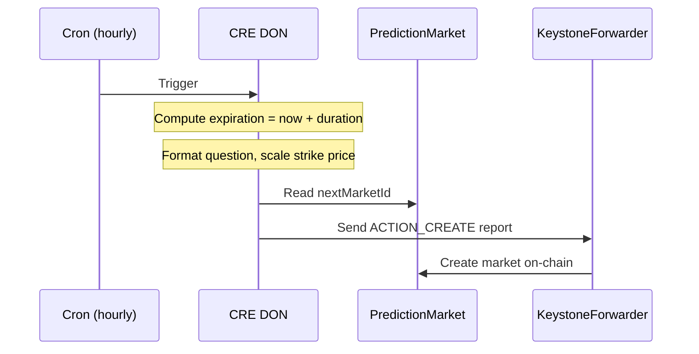
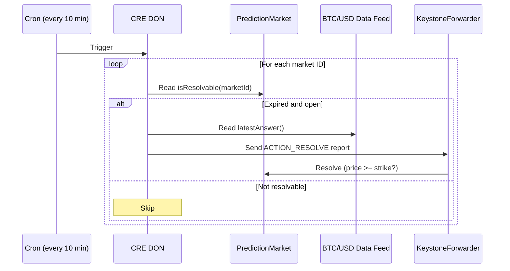
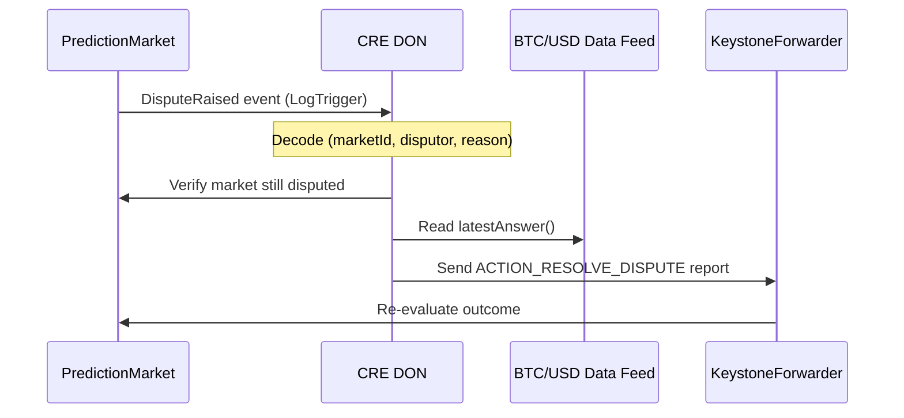

import { Aside, Accordion } from "@components"

{/* prettier-ignore */}
<Aside type="note">
This template uses **Chainlink Data Feeds** (BTC/USD) for deterministic on-chain resolution. For an AI-powered prediction market using Gemini AI, see the [Prediction Market Demo](/cre-templates/prediction-market-demo).
</Aside>

## What This Template Does

This template implements the **full prediction market lifecycle** using three CRE workflows that share a single `PredictionMarket` smart contract:

1. **Market Creation** (Cron, hourly) — Creates new binary prediction markets with configurable strike prices and expiration times
2. **Market Resolution** (Cron, every 10 minutes) — Checks expired markets and resolves them using the Chainlink BTC/USD Data Feed
3. **Dispute Management** (LogTrigger) — Listens for `DisputeRaised` events and re-evaluates outcomes with fresh price data

**Key Technologies:**

- **CRE (Chainlink Runtime Environment)** — Multi-workflow orchestration with DON consensus
- **Chainlink Data Feeds** — Deterministic BTC/USD price resolution
- **LogTrigger + Cron** — Event-driven disputes with periodic creation and resolution

---

## How It Works

### Market Creation



### Market Resolution



### Dispute Management



---

## Project Structure

```
prediction-market-ts/
├── contracts/          # Shared contracts and bindings
├── market-creation/    # Workflow 1: Create markets
├── market-resolution/  # Workflow 2: Resolve expired markets
└── market-dispute/     # Workflow 3: Handle disputes
```

---

## Getting Started

<Accordion title="Install dependencies" number={1}>

```bash
cd contracts && bun install && cd ..
cd market-creation && bun install && cd ..
cd market-resolution && bun install && cd ..
cd market-dispute && bun install && cd ..
```

</Accordion>

<Accordion title="Run tests" number={2}>

```bash
cd market-creation && bun test && cd ..
cd market-resolution && bun test && cd ..
cd market-dispute && bun test && cd ..
```

</Accordion>

<Accordion title="Simulate workflows" number={3}>

**Market Creation:**

```bash
cre workflow simulate market-creation --target staging-settings
```

**Market Resolution:**

```bash
cre workflow simulate market-resolution --target staging-settings
```

**Dispute Management** (requires a transaction that emitted `DisputeRaised`):

```bash
cre workflow simulate market-dispute --target staging-settings \
  --non-interactive \
  --trigger-index 0 \
  --evm-tx-hash <TX_THAT_EMITTED_DISPUTE_RAISED> \
  --evm-event-index 0
```

Broadcast any workflow to write on-chain:

```bash
cre workflow simulate market-creation --target staging-settings --broadcast
```

</Accordion>

<Accordion title="Deploy your own contract" number={4}>

A demo contract is pre-deployed on Sepolia at `0xEb792aF46AB2c2f1389A774AB806423DB43aA425`.

To deploy your own with Foundry:

```bash
forge create src/PredictionMarket.sol:PredictionMarket \
  --broadcast --private-key $PRIVATE_KEY \
  --rpc-url https://ethereum-sepolia-rpc.publicnode.com \
  --constructor-args \
    0x15fc6ae953e024d975e77382eeec56a9101f9f88 \
    0x1b44F3514812d835EB1BDB0acB33d3fA3351Ee43 \
    86400
```

Constructor arguments:
- **Forwarder**: `0x15fc6ae953e024d975e77382eeec56a9101f9f88`
- **Price Feed**: `0x1b44F3514812d835EB1BDB0acB33d3fA3351Ee43` (BTC/USD on Sepolia)
- **Dispute Window**: `86400` (24 hours in seconds)

</Accordion>

## Customization

- **Use a different asset** — Deploy with a different `priceFeed` address (e.g., ETH/USD: `0x694AA1769357215DE4FAC081bf1f309aDC325306`)
- **Change market duration** — Update `durationSeconds` in `market-creation/config.staging.json`
- **Change resolution frequency** — Update `schedule` in `market-resolution/config.staging.json`
- **Change dispute window** — Deploy a new contract with a different `disputeWindow` arg

For full details, see the [TypeScript README](https://github.com/smartcontractkit/cre-templates/tree/all-new-templates/starter-templates/prediction-market/prediction-market-ts) on GitHub.
