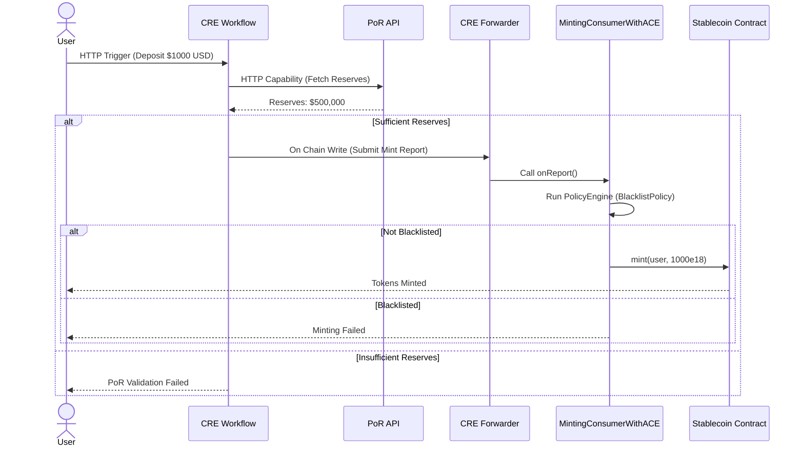
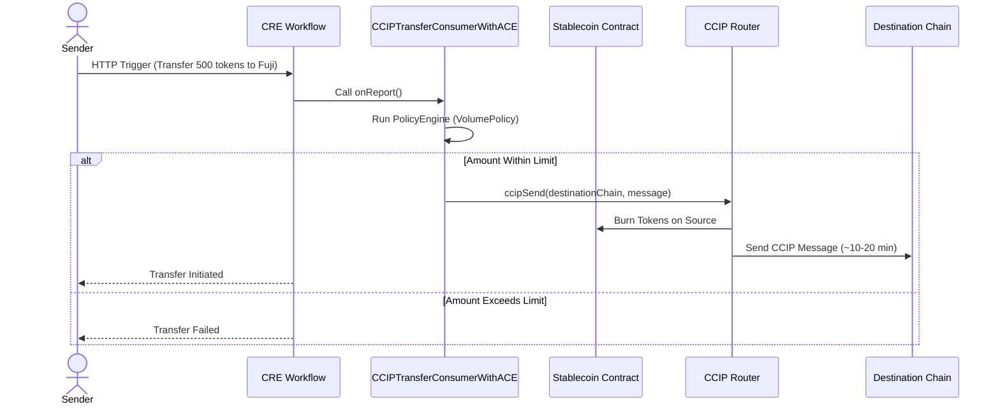

import { Aside, Accordion } from "@components"

## What This Template Does

This repository demonstrates how financial institutions can build a **secure, compliant, multi-chain stablecoin** using Chainlink's complete service stack. The demo progresses through three phases:

**Phase 1:** Traditional banks trigger stablecoin minting and redemption using SWIFT-style messages via HTTP. CRE orchestrates the workflow, validates messages, and submits cryptographically-signed reports to mint or burn tokens on-chain.

**Phase 2:** Cross-chain stablecoin transfers using CCIP. Users can transfer tokens between Ethereum Sepolia and Avalanche Fuji testnets with automatic token burning on the source chain and minting on the destination.

**Phase 3:** Advanced multi-service integration (production requires additional audits and hardening) that combines:

1. **Proof of Reserve (PoR)** - Validates sufficient off-chain reserves before minting (prevents over-collateralization issues)
2. **Automated Compliance Engine (ACE)** - Enforces on-chain policies like address blacklisting for regulatory compliance
3. **CCIP** - Secure cross-chain transfers with compliance checks at both mint and transfer stages

**Key Technologies:**

- **CRE (Chainlink Runtime Environment)** - Orchestrates multi-service workflows with DON consensus
- **PoR (Proof of Reserve)** - External reserve validation
- **ACE (Automated Compliance Engine)** - On-chain policy enforcement
- **CCIP (Cross-Chain Interoperability Protocol)** - Secure token bridging

---

## How It Works

### Flow 1: Stablecoin Issuance with PoR + ACE



### Flow 2: Cross-Chain Transfer with ACE



---

## Repository Structure

### Workflows Directory

Three progressive CRE workflows demonstrating increasing complexity:

- `bank-stablecoin-workflow/` - Phase 1: Basic mint/redeem operations
- `ccip-transfer-workflow/` - Phase 2: Cross-chain CCIP transfers
- `bank-stablecoin-por-ace-ccip-workflow/` - Phase 3: PoR + ACE + CCIP integration

### Contracts Directory

Smart contracts for stablecoin and ACE integration:

- `StablecoinERC20.sol` - Core stablecoin with mint/burn roles
- `MintingConsumer.sol` - Phase 1: Basic CRE consumer
- `CCIPTransferConsumer.sol` - Phase 2: CCIP consumer
- `MintingConsumerWithACE.sol` - Phase 3: ACE-protected mint consumer
- `CCIPTransferConsumerWithACE.sol` - Phase 3: ACE-protected CCIP consumer
- `policies/AddressBlacklistPolicy.sol` - ACE blacklist policy
- `extractors/UnifiedExtractor.sol` - ACE parameter extractor for both mint and CCIP operations

---

## Prerequisites

To run this demo, you'll need:

**Tools:**

- Git
- [Foundry](https://book.getfoundry.sh/getting-started/installation) (`forge`, `cast`, `anvil`)
- [Bun](https://bun.sh/) (JavaScript runtime and package manager)
- [Chainlink Runtime Environment CLI](https://docs.chain.link/cre)

**Testnet Funds:**

- ETH on Sepolia testnet ([Chainlink Faucet](https://faucets.chain.link))
- ETH on Fuji testnet
- LINK tokens

---

## Getting Started

<Accordion title="Option 1: Test with Pre-Deployed Contracts (Fastest)" number={1}>

This repo includes pre-deployed Phase 3 contracts on Sepolia for immediate testing.

**Pre-Deployed Contracts on Sepolia:**

| Contract                     | Address                                      |
| ---------------------------- | -------------------------------------------- |
| StablecoinERC20              | `0xF9ec4EE99B992A6AA5C70619092E2c605480dE8e` |
| BurnMintTokenPool            | `0x37BeD199bBDCfd86B01989bE271EC022430FE2D6` |
| PolicyEngine                 | `0x697B79dFdbe5eD6f9d877bBeFac04d7A28be5CA1` |
| AddressBlacklistPolicy       | `0xA5Db8159CD4084570FD248A7ec8457B3E348c3A6` |
| VolumePolicy (100-10k range) | `0xfd09CF4Db1eB6e8a75653C29816e56095A3B2b56` |
| MintingConsumerWithACE       | `0x24c0f5C1A286Fbd27A730303a1a845b4cf85F0Cc` |
| CCIPTransferConsumerWithACE  | `0xFa031de805af3a9A72D37f57a01634ADF4a61cD5` |

**Quick Test Steps:**

```bash
# Create configuration files
cp .env.example .env
cp secrets.yaml.example secrets.yaml

# Set project root
export CRE_PROJECT_ROOT=$(pwd)

# Install workflow dependencies
cd bank-stablecoin-por-ace-ccip-workflow && bun install && cd ..

# Dry run test (no wallet/gas needed)
cre workflow simulate bank-stablecoin-por-ace-ccip-workflow \
  --target local-simulation \
  --trigger-index 0 \
  --non-interactive \
  --http-payload @$CRE_PROJECT_ROOT/bank-stablecoin-por-ace-ccip-workflow/http_trigger_payload.json
```

</Accordion>

<Accordion title="Option 2: Deploy Your Own" number={2}>

Choose your learning path:

**Incremental (Recommended for Learning):**

Build the system step-by-step across 3 progressive phases. Each phase adds new capabilities:

- [Phase 1: Basic Stablecoin](https://github.com/smartcontractkit/cre-templates/tree/main/starter-templates/stablecoin-ace-ccip/bank-stablecoin-workflow) - Deploy stablecoin with mint/redeem
- [Phase 2: Cross-Chain CCIP](https://github.com/smartcontractkit/cre-templates/tree/main/starter-templates/stablecoin-ace-ccip/ccip-transfer-workflow) - Add cross-chain transfers
- [Phase 3: PoR + ACE + CCIP](https://github.com/smartcontractkit/cre-templates/tree/main/starter-templates/stablecoin-ace-ccip/bank-stablecoin-por-ace-ccip-workflow) - Production-ready setup

</Accordion>

---

## CRE + PoR + ACE + CCIP Capabilities

This demo showcases the complete Chainlink service stack working together:

| Service                         | Usage in Demo                               | Benefit                                          |
| ------------------------------- | ------------------------------------------- | ------------------------------------------------ |
| **CRE (Runtime Environment)**   | Orchestrates multi-service workflows        | Off-chain computation with on-chain verification |
| **PoR (Proof of Reserve)**      | Validates off-chain reserves before minting | Prevents over-collateralization                  |
| **ACE (Compliance Engine)**     | Enforces address blacklist policies         | Regulatory compliance (sanctions, AML)           |
| **CCIP (Cross-Chain Protocol)** | Secure token transfers between chains       | Burn-and-mint cross-chain bridging               |

**CRE Capabilities Demonstrated:**

- ✅ **HTTP Triggers** - Banking system integration via REST API
- ✅ **Node Mode** - Fetch external data (PoR Mock Data) with DON consensus
- ✅ **EVM Capabilities** - Write signed reports on-chain
- ✅ **Multi-Service Orchestration** - Coordinate PoR → ACE → Mint → CCIP flows

**ACE Capabilities Demonstrated:**

- ✅ **PolicyEngine** - Central policy registry and execution
- ✅ **Custom Extractors** - Parse CRE's `onReport(bytes,bytes)` function
- ✅ **Address Blacklist Policy** - Block mints/transfers to sanctioned addresses
- ✅ **Upgradeable Proxies** - ERC-1967 pattern for all ACE components

---

## Troubleshooting

**Quick Tips:**

- **Workflow won't compile?** → Run `cd <workflow> && bun install`
- **ACE not blocking?** → See the TROUBLESHOOTING.md in the repository
- **CCIP not arriving?** → Wait 10-20 min, check [CCIP Explorer](https://ccip.chain.link)

---

## Security Considerations

1. **This is a demo project** - Not production-ready
2. **Verify PoR data sources** - Demo uses mock data; real implementations should use live PoR feeds
3. **ACE policies are examples** - Customize policies for your compliance requirements
4. **Use your own RPC for stability** - For stable deployment and chainwrite operations it is advised to use your own private RPCs
