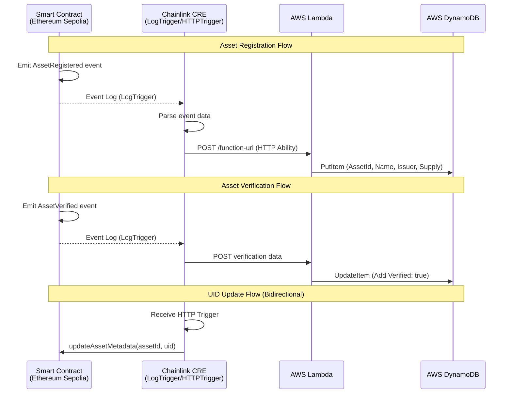

import { Aside, Accordion } from "@components"

## What This Template Does

This project demonstrates the integration of Chainlink Runtime Environment (CRE) with LogTrigger and HTTP abilities to enable seamless off-chain data orchestration for tokenized assets. The project tokenizes various real-world assets (RWAs) using Ethereum Solidity smart contracts and leverages Chainlink CRE, AWS DynamoDB, and Lambda functions to track the full lifecycle of these tokenized assets.

### Tokenization and Lifecycle Management

The core of this project is an Ethereum-based Solidity smart contract that facilitates the tokenization of diverse asset classes, including invoices, Treasury bills (T-bills), loans, and carbon credits. Users interact with the contract via specialized functions to manage asset operations, such as:

- **Register**: Onboard a new asset into the system.
- **Verify**: Validate asset authenticity and compliance.
- **Transfer**: Execute peer-to-peer asset transfers.
- **Redeem**: Liquidate or burn tokens to redeem underlying value.

To support generalized use cases, regulators, auditors, and investors require robust monitoring and auditing capabilities for these tokenized assets and their associated operations. While on-chain data is immutable and verifiable via the blockchain, querying it directly is inefficient and lacks user-friendly interfaces due to the opaque nature of raw transaction logs.

This project addresses these challenges by employing Chainlink CRE to bridge on-chain events with off-chain storage and retrieval:

- **LogTrigger** captures events emitted by the tokenization platform contract.
- Extracted event data is parsed, normalized, and encapsulated into a structured HTTP payload.
- The **HTTP Ability** dispatches this payload as a RESTful API request to an AWS Lambda function.
- The Lambda function persists the processed data into an AWS DynamoDB NoSQL database.

This architecture decouples on-chain immutability from off-chain accessibility, providing stakeholders with near-real-time visibility into asset lifecycles without compromising blockchain integrity.

---

## Flow Diagram



---

## Prerequisites

Before proceeding, ensure the following are set up:

**Tools:**

- [CRE CLI](https://docs.chain.link/cre/getting-started/cli-installation/macos-linux)
- [git](https://git-scm.com/book/en/v2/Getting-Started-Installing-Git)
- [Node.js](https://nodejs.org/en) (v18+ recommended)
- [Bun](https://bun.sh/)

**Blockchain:**

- Ethereum Sepolia testnet access (e.g., via Alchemy or Infura RPC endpoint)
- Sepolia test tokens (ETH) for gas

**AWS:**

- AWS account (Free Tier eligible) with IAM roles for DynamoDB and Lambda

---

## Getting Started

<Accordion title="Clone and configure the project" number={1}>

```bash
git clone https://github.com/smartcontractkit/cre-templates.git
cd cre-templates/starter-templates/tokenized-asset-servicing/
```

You can update the Ethereum Sepolia RPC url with yours or use the default one in `project.yaml`:

```yaml
local-simulation:
  rpcs:
    - chain-name: ethereum-testnet-sepolia
      url: <YOUR_RPC_URL>
```

</Accordion>

<Accordion title="Deploy Smart Contracts" number={2}>

Change to the contracts directory and install dependencies:

```bash
npm install
```

Deploy the contract to Ethereum Sepolia testnet:

```bash
npx tsx ./1_deploy.ts
```

Then create the config file and update it with your deployed contract address:

```bash
cd ../asset-log-trigger-workflow
cp config.json.example config.json
```

Update `assetAddress` in `config.json` with your deployed contract address.

</Accordion>

<Accordion title="Set up AWS DynamoDB" number={3}>

1. Go to the [AWS Management Console](https://aws.amazon.com/console/)
2. Search for DynamoDB and create a table named `AssetState` with partition key: `AssetId` (string)
3. Leave other settings as default

</Accordion>

<Accordion title="Set up AWS Lambda Function" number={4}>

1. Search for Lambda in AWS dashboard
2. Create a new function named `Asset-lambda-function` with Node.js 22 runtime
3. Copy the Lambda function code from `lambda-function/index.mjs` in the repository
4. Update the `yourAwsRegion` and `TABLE_NAME` variables
5. Deploy the function
6. Under Configuration → Function URL, create a URL with "NONE" auth type
7. Add the function URL to `asset-log-trigger-workflow/config.json`
8. Grant the Lambda function `AmazonDynamoDBFullAccess` permission via IAM

</Accordion>

<Accordion title="Install workflow dependencies" number={5}>

```bash
cd asset-log-trigger-workflow
bun install
```

Create a `.env` file from the example:

```bash
cd ..
cp .env.example .env
```

Add your private key (without the 0x prefix) to the `.env` file.

</Accordion>

---

## Usage Examples

<Accordion title="Register an Asset" number={1}>

From the contracts directory:

```bash
npx tsx ./2_registerNewAsset.ts
```

Then trigger CRE with the event log:

```bash
cd ../asset-log-trigger-workflow
cre workflow simulate asset-log-trigger-workflow --broadcast --target local-simulation
```

Select LogTrigger (option 1) and enter the transaction hash and event index (1 for AssetRegistered).

</Accordion>

<Accordion title="Verify an Asset" number={2}>

```bash
npx tsx ./3_verifyAsset.ts
```

Then trigger CRE with event index 0 for the AssetVerified event.

</Accordion>

<Accordion title="Update Asset UID via HTTP Trigger" number={3}>

```bash
cre workflow simulate asset-log-trigger-workflow --broadcast --target local-simulation
```

Select HttpTrigger (option 2) and enter a JSON payload:

```json
{ "assetId": 1, "uid": "bca71bc9-d08e-48ef-8ad1-acefe95505a9" }
```

Verify the update:

```bash
npx tsx ./4_readUid.ts
```

</Accordion>

<Accordion title="Mint Tokens" number={4}>

```bash
npx tsx ./5_mint.ts
```

Then trigger CRE with event index 1 for the TokensMinted event.

</Accordion>

<Accordion title="Redeem Tokens" number={5}>

```bash
npx tsx ./6_redeem.ts
```

Then trigger CRE with event index 1 for the TokensRedeemed event.

</Accordion>

---

## Troubleshooting

**AWS Lambda Internal Server Error on Invocation:**
Verify that the Lambda execution role has the necessary IAM permissions for DynamoDB operations (e.g., `dynamodb:PutItem`, `dynamodb:UpdateItem`). Check CloudWatch Logs for detailed error traces.

**Chainlink CRE Fails to Detect Events:**
Transactions may emit multiple events in sequence; ensure the LogTrigger targets the correct event index. Use Etherscan to inspect raw logs and correlate with CRE configuration.

**Solidity Compilation Errors:**
These often stem from version incompatibilities in OpenZeppelin contracts. Use OpenZeppelin v5.x for ERC-1155 implementations.

---

## Security Considerations

1. **This is a demo project** - Not production-ready
2. **Lambda function security** - In production, use proper authentication for Function URLs
3. **IAM permissions** - Follow least-privilege principles for production deployments
4. **Secrets hygiene** – Keep real secrets out of version control; use secure secret managers for `.env` values.
