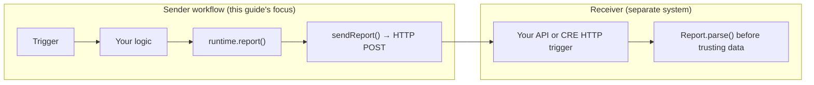

import { Aside } from "@components"

The CRE SDK provides an HTTP client that allows your workflows to interact with external APIs. Use it to fetch offchain data, send results to other systems, or trigger external events.

{/* prettier-ignore */}
<Aside type="caution" title="Using timestamps in requests">
  If your HTTP request includes timestamps (e.g., for authentication headers or time-based queries), use `runtime.now()` instead of `Date.now()`. This ensures all nodes use the same timestamp and reach consensus. See [Using Time in Workflows](/cre/guides/workflow/time-in-workflows) for details.
</Aside>

{/* prettier-ignore */}
<Aside type="caution" title="Parse responses before aggregation">
  When using a numeric aggregation method (such as `median`), always parse the HTTP response **inside** your node function and return a numeric value — never pass the raw response body to the aggregation step. If your endpoint returns an error string and your node function passes that string to a median aggregation, consensus will fail with `unsupported type for median aggregation`. See the [best practices section](/cre/guides/workflow/using-http-client/get-request#best-practices) of the GET request guide for correct and incorrect patterns.
</Aside>

These guides will walk you through the common use cases for the HTTP client.

## CRE reports over HTTP

A **CRE report** is a DON-signed package your workflow creates with `runtime.report()` (TypeScript) or `runtime.GenerateReport()` (Go). It contains your encoded payload, workflow metadata, and cryptographic signatures. It is **not** a [Data Streams](/data-streams) report—those come from a different product.

Most secure HTTP integrations use two roles:

| Step | Who                       | What happens                                                                                                                                  |
| ---- | ------------------------- | --------------------------------------------------------------------------------------------------------------------------------------------- |
| 1    | **Sender** (CRE workflow) | Run business logic, encode payload                                                                                                            |
| 2    | **Sender**                | `runtime.report()` — DON agrees and signs                                                                                                     |
| 3    | **Sender**                | `sendReport()` — POST report bytes to your URL                                                                                                |
| 4    | **Receiver**              | Verify signatures, then use payload — see [Verifying CRE Reports Offchain](/cre/guides/workflow/using-http-client/verifying-reports-offchain) |

You do **not** download a report from elsewhere before submitting. The sender workflow **creates** it in step 2. Validation always happens on the **receiver** side (CRE workflow, your API, or an onchain forwarder).

## Guides

- **[Making GET Requests](/cre/guides/workflow/using-http-client/get-request)**: Learn how to fetch data from a public API using a `GET` request.
- **[Making POST Requests](/cre/guides/workflow/using-http-client/post-request)**: Learn how to send data to an external endpoint using a `POST` request.
- **[Submitting Reports via HTTP](/cre/guides/workflow/using-http-client/submitting-reports-http)**: Learn how to submit cryptographically signed reports to an external HTTP endpoint.
- **[Verifying CRE Reports Offchain](/cre/guides/workflow/using-http-client/verifying-reports-offchain)**: Verify report signatures and read workflow metadata when receiving reports over HTTP or other offchain channels.
